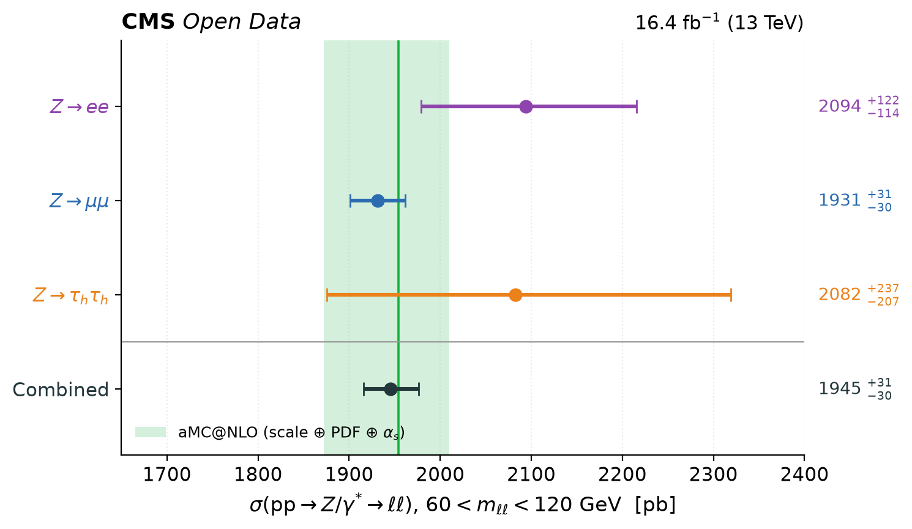
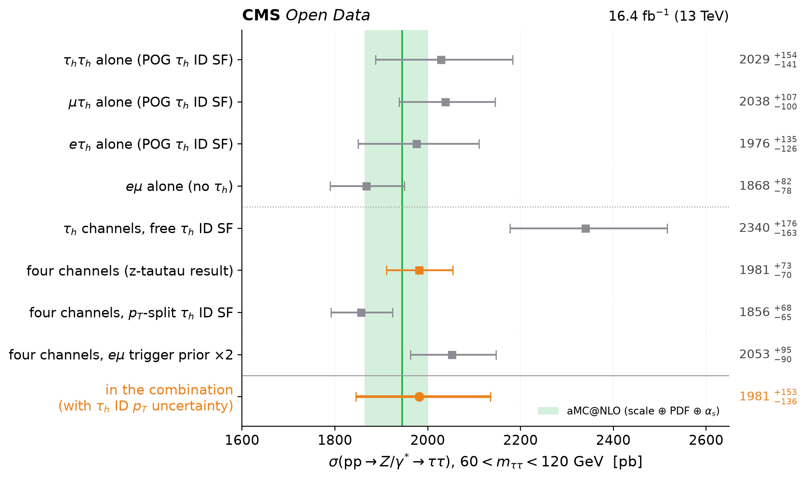

# Z → ee ⊕ Z → μμ ⊕ Z → ττ: TRExFitter MultiFit

One profile-likelihood fit (TRExFitter v1.8.0 MultiFit) of the three BND-school channels on CMS Open
Data 2016 G+H (16.4 fb⁻¹, √s = 13 TeV). Z → ττ is the four-channel measurement of z-tautau
(τhτh + μτh + eτh + eμ, 13 regions). Shared nuisance parameters are fitted jointly.

> **σ(pp → Z/γ\* → ℓℓ, 60 < m_ℓℓ < 120 GeV) = 1949 ⁺³⁰₋₃₀ pb**
> = 1949.3 ± 0.5 (stat) ⁺³⁰·²₋₂₉.₆ (syst, including 21.9 pb luminosity and 12.8 pb acceptance) pb,
> per lepton flavour, assuming lepton universality; μ_Z = 0.9977 ⁺⁰·⁰¹⁵⁵₋₀.₀₁₅₂ × 1953.93 pb.
>
> aMC@NLO (NNLO-normalised): 1954 ⁺⁵⁶₋₈₂ pb. CMS (2024): 1952 ± 49 pb.

This result (17 Sep 2026, fits on HTCondor) **supersedes the frozen three-channel combination**
ee ⊕ μμ ⊕ τhτh = 1945 ⁺³¹₋₃₀ pb, which stays available at the git tag `zmumu-freeze-2026-09-17` (repository
`FREEZE.md`; its TRExFitter jobs are in `work_freeze_2026-09-17/`, git-ignored). The ee and μμ inputs are the
frozen ones; what changed is ττ.

All numbers: `output/result.json`. All figures: `output/plots/` (PDF and PNG).

| | figure |
|---|---|
| each channel and the combination against the prediction | `summary` |
| each channel against the published ATLAS/CMS measurement of the same decay | `channels_vs_published` |
| the combination against the published combined measurements | `combined_vs_published` |
| what the ττ line is made of: z-tautau's own fits of its final states, and the line as it enters here | `tautau_channels` |
| uncertainty by source | `breakdown` |
| the 20 parameters with the largest impact, with their pulls | `impacts` |
| every nuisance parameter | `pulls` |
| profile likelihood of the combined cross section | `nll_scan` |
| the combination under alternative likelihood models | `variations` |



## Results

| | σ(60–120) [pb] | from |
|---|---|---|
| **combined** | **1949.3 ⁺³⁰·²₋₂₉.₆** | common POI, all three channels |
| Z → ee | 2093.8 ⁺¹²¹·⁸₋₁₁₄.₅ | standalone fit, same model |
| Z → μμ | 1931.1 ⁺³⁰·⁸₋₃₀.₁ | standalone fit, same model |
| Z → ττ | 1981.3 ⁺¹⁵³₋₁₃₆ | standalone fit, same model (z-tautau's own: 1981.3 ⁺⁷³₋₇₀; the difference is `TauIDpT_tautau`, below) |
| aMC@NLO | 1953.9 ⁺⁵⁶·¹₋₈₁.₇ | scale +2.5/−3.9 %, PDF 0.74 %, α_s 1.3 % |

* **Channel compatibility.** The three-POI fit (one σ per channel, every shared NP profiled together)
  gives ee 2097.9, μμ 1943.7, ττ 1978.0 pb. Against the common POI,
  −2 ln(L_common/L_split) = **1.95 for 2 degrees of freedom, p = 0.38**. The three POIs are correlated through
  the luminosity: ee–μμ 0.39, ee–ττ 0.43, μμ–ττ 0.67.
* **Weights.** The result is carried by μμ. Without ee it is 1936.7 pb, without ττ 1943.9 pb (`variations`).
* **Goodness of fit.** Saturated model: μμ p = 0.79, ττ p = 0.15, **ee p = 4 × 10⁻⁴²**. The combined
  p = 4 × 10⁻²² is entirely the ee peak shape ("The ee channel").
* **Fit quality.** Every fit (combined, three-POI, standalone, stat-only, scan, 13 of 14 variations, both checks)
  ends with MIGRAD 0, HESSE 0, MINOS 0 and **no covariance forced positive-definite** (checked in the logs, recorded
  as `pos_def_forced`). HESSE and MINOS on μ_Z agree to 0.07 % (`combined.hesse_over_minos` = 1.0007), no
  constrained parameter has a post-fit error above 1.02, and 102/102 ranking refits converged. This needs MINUIT
  **strategy 3** (`../CLAUDE.md` item 9). The exception is `split_all_channels`, which only converges with
  strategy 2; only its MINOS interval is used.
* **The channels' own numbers.** ee 1840.8 ± 29.9 pb (`z-ee/Zee_fit.tar.gz`), μμ 1931.0 pb, ττ 1981.3 ⁺⁷³₋₇₀ pb.
  μμ and ττ are reproduced exactly; ee differs, as explained below.

## The likelihood

Every channel enters with **its own TRExFitter config and fit inputs**:

| channel | config | inputs | signal | σ_ref(60–120) |
|---|---|---|---|---|
| ee | `z-ee/fit.config` | `z-ee/Zee_fit.tar.gz` → `Histograms/Zee_fit_histos.root` (bin by bin identical to `datasets/z-ee/zee.root`, checked on every run) | `DYee` | 1954.10 pb (the tarball's `reference_cross_section.txt`) |
| μμ | `z-mumu/fit/zmumu.config` | `z-mumu/fit/fitinputs/zmumu.root` | `DYmumu` | 1953.93 pb |
| ττ | `z-tautau/fit/ztautau.config` (13 regions: `tautau_SR0/1/2`, `mutau_SR_dm*`, `etau_SR_dm*`, `emu_SR`, `emu_CRtt`) | `z-tautau/fit/fitinputs/ztautau.root` | the 15 `DYtautau_tDM*` templates, read from the metadata (`signal_samples`) | 1944.88 pb |

The only changes, made by `mf/trexcfg.adapt_channel` and driven by `config/channels.json`:

1. **One POI.** Each channel's signal NormFactor is renamed `mu_Z`, and a constant NormFactor
   `xsref_<channel>` = 1953.93 pb / σ_ref(channel) is added on the same samples. So
   σ = μ_Z × 1953.93 pb in every channel, even though the three aMC@NLO references differ (by 0.46 % for ττ).
2. **Acceptance.** μμ quotes σ(60–120) = σ_fid / A with A from aMC@NLO; its δA/A (0.70 %, eight parameters,
   `z-mumu/zmumu/acceptance.py`) enter as OVERALL parameters `Acc_*` on the signal, read by key from
   `zmumu.root.meta.json`. ee and ττ have no such block: their theory templates are normalised to a constant
   σ(60–120), so `PDF`/`QCDScale`/`PS_*` carry A × ε inside their fits (adding `Acc_*` would double count).
3. **Correlations by name,** as `fitting/CONVENTIONS.md` §3 prescribes. Shared are `Lumi`, `Pileup`,
   `L1Prefiring`, `PDF`, `QCDScale`, `PS_FSR`, `PS_ISR`, `XS_TTbar` (ee, μμ), `XS_DYtautau`, `XS_WJets`,
   `XS_SingleTop/WW/WZ/ZZ`. Channel-specific: everything electron, muon, τ, MET, jets, fakes, MC statistics,
   the μμ `Acc_*`, `SigModel` → `SigModel_mumu`, and the ττ `MuonID/Iso/Trigger/Scale`,
   `ElectronID/Reco/Scale` → `<name>_tautau` (next section).
4. **ee: shape and normalisation as separate parameters.** Every template (HISTO) systematic of ee
   enters twice. Its normalisation keeps the shared name, and its shape gets an ee-only parameter
   `<NP>_eeShape` (TRExFitter `DropShapeIn` / `DropNorm` on the same templates).
5. **μμ: `mumu_CRemu` removed.** It selects the same data as the ττ eμ channel. It is `Type: VALIDATION` in the
   μμ config, so it never was in the μμ likelihood and nothing changes (`checks.mumu_cremu_validation`: identical
   fit). Fitted as a control region it would move μμ by −0.4 pb and shrink its uncertainty by 2.6 %
   (`checks.mumu_cremu_control`): that is all that is given up.
6. **ττ: one modelling uncertainty added**, `TauIDpT_tautau` (next section).

Nothing else is touched: binning, samples, smoothing, symmetrisation, the channels' own DropBins (ττ drops its
one empty bin, `tautau_SR2` bin 1, itself), MC statistics.

## The ττ channel: what z-tautau asked the combination to decide

`z-tautau/docs/11-combination-inputs.md` §4–7 lists what a combiner must decide or understand. Each item has a
fit in `variations` (figure `variations`, numbers below); `tautau_channels` shows the ττ sub-measurements.



1. **The τh ID scale factor is not flat in p_T (§7.3) → `TauIDpT_tautau`, ±6.3 % on the ττ signal, in the baseline.**
   The ττ fit assumes one scale factor per decay mode at every p_T. z-tautau's cross-check with separate scale
   factors below 40 GeV moves their μ_Z from 1.019 to 0.954 (1.8 × their total uncertainty); no parameter of their
   fit covers that, and they ask a combination that wants a conservative ττ input to carry it. It enters as one
   OVERALL parameter on the 15 signal templates, its size **read from their two published fits**
   (`ztautau_fit_result.json`, `ztautau_ptsplit_fit_result.json`), not typed in. The ττ line becomes
   1981 ⁺¹⁵³₋₁₃₆ pb; in the combined fit the parameter is constrained to 0.49 by μμ and ee (pull +0.18) and
   costs 2.2 pb in the covariance decomposition (±4.6 pb in the refit ranking). Why it belongs in the baseline: taken at face value, ττ moves the combination by **+1.7 pb with
   its nominal model and −13.8 pb with its p_T-split model** — a 15 pb spread from one modelling choice inside a
   channel that quotes ±3.6 %. With the parameter the baseline sits between the two and depends little on which
   is right.
2. **The ττ result is a compromise of two sub-measurements 2.6σ apart (§7.1):** eμ alone (no τh) 1868 ⁺⁸²₋₇₈ pb,
   the τh channels alone with free scale factors 2340 ⁺¹⁷⁶₋₁₆₃ pb. The baseline uses the four-channel likelihood,
   z-tautau's default. Using only one of them instead changes the combination by −6.2 pb (eμ only) or −0.4 pb
   (τh channels only).
3. **The eμ trigger prior (§7.2):** doubled (the pre-review treatment), −0.3 pb.
4. **Are the ττ muon and electron parameters the same quantity as μμ's and ee's? (§4) — No, decorrelated.** ττ takes
   them from the POG jsons, z-mumu measures its own with tag-and-probe, and z-ee's `ElectronID` is the ±5.9 %
   ECAL-gap artefact. Sharing a name would claim one measurement. Shared by name instead: −0.9 pb.
5. **ττ constrains the shared theory parameters (§5)** through the acceptance ratios of its final states
   (`QCDScale` post-fit 0.53, `PS_FSR` 0.36, `Pileup` 0.44). The μμ acceptance sits in its own `Acc_*`
   parameters, so this cannot shrink the μμ acceptance uncertainty. With the ττ theory parameters not shared: −0.7 pb.
6. **tt̄: free `mu_ttbar` or `XS_TTbar`? (§4)** Next section.

## tt̄: the eμ control region, and who uses it

ττ normalises tt̄ with a free factor `mu_ttbar`, determined by its control region `emu_CRtt` (46 k events), and
has no `XS_TTbar`. μμ and ee constrain tt̄ with `XS_TTbar` (6 % prior). All three use the same powheg samples
and 831.76 pb, so the question is well posed. Three answers were fitted:

| tt̄ treatment | σ [pb] | Δ | what happens |
|---|---|---|---|
| **baseline:** free `mu_ttbar` in ττ, `XS_TTbar` prior in ee and μμ | 1949.3 ⁺³⁰·²₋₂₉.₆ | | `mu_ttbar` = 1.113 ± 0.035; `XS_TTbar` +0.60 ± 0.92 |
| the control region for all channels: `mu_ttbar` also scales tt̄ in μμ and ee, no `XS_TTbar` | 1953.8 ⁺³⁰·⁵₋₂₉.₉ | +4.5 | `mu_ttbar` = 1.120 ± 0.034, `Lumi` −0.40 → −0.52 |
| one 6 % `XS_TTbar` everywhere, constrained by the control region, no free factor | 1944.3 ⁺²⁹·⁸₋₂₉.₂ | −5.0 | `XS_TTbar` +1.53 ± 0.46, `Lumi` −0.40 → −0.23 |

The two alternatives bracket the baseline by ±5 pb (0.16σ); none is wrong, and the choice is stated rather than
hidden. Why the baseline is the two-parameter model:

* **`mu_ttbar` = 1.11 is not the tt̄ cross section.** CMS measures σ(tt̄) at data/theory ≈ 0.97. The 11 % excess is
  specific to the control region (eμ trigger efficiency — `EmuTrigger` is pulled to −1.4σ at the same time —, the
  MET > 80 GeV and D_ζ < −40 selection, `TopPt` at +1.2σ); z-tautau says so itself (§7.4). Applied to tt̄ under
  the μμ and ee peaks, it raises a background whose level the 10 M-event shape fit is sensitive to (`XS_TTbar`
  moves σ by 1.5 pb per 6 %), without a prior to hold it: +4.5 pb and a 1 % larger uncertainty.
* **With one constrained `XS_TTbar` and no free factor, the control region becomes a luminosity monitor.** It then
  measures the product `Lumi` × `XS_TTbar` × eμ trigger × b-tag, and its 11 % excess is shared out by prior
  width: `XS_TTbar` takes +1.5σ, and `Lumi` a share that moves every channel (−5.0 pb). A control-region
  mismodelling must not decide the luminosity of a measurement whose largest uncertainty is the luminosity. This
  is what a free normalisation factor is for.
* `mu_ttbar` is third in the refit ranking (±11 pb) for the same reason: fixing it at ±1σ forces `Lumi` to
  compensate in the control region. It is a correlation, not an uncertainty missing from the total.

To change the baseline, move the `channel_overrides` of the variation into the channels of `config/channels.json`
and rerun (`python run.py prepare && python run.py condor --submit`, ~15 min).

## The ee channel, and why point 4 is needed

With all three channels correlated as delivered, the fit has **no positive-definite minimum**
(TRExFitter retries up to strategy 3 and crashes). The cause is in the ee inputs:

* **The ee model does not describe its own peak shape:** saturated-model p = 4 × 10⁻⁴² with 6.3 M events
  in 30 × 2 GeV bins. The fit absorbs the mismatch by pulling template parameters (`Pileup` −1.7σ,
  `L1Prefiring` +1.9σ, `QCDScale` −1.8σ on their ee-shape parts) and constraining them far below their priors.
  Shared with μμ, those pulls would move the μμ normalisation.
* **The ee electron-ID uncertainty, ±5.9 %, is an artefact.** The official UL2016postVFP Medium-ID
  scale-factor map gives about 1.2 % per Z → ee event. In the ECAL barrel–endcap gap
  (1.444 < |η_SC| < 1.566) it returns the placeholder sf = 1 ± 1, and z-ee does not veto the gap. The
  shape of this ±100 % variation on ~5 % of events pins the whole 5.9 % normalisation.
  That is where the channel's quoted ±1.6 % precision comes from (details in `docs/systematics.md`).

Splitting shape from normalisation keeps the correlated normalisations physical, while ee's shape
mismodelling stays in ee-only parameters. The price is honest: once the peak shape no longer pins it,
ee's normalisation is limited by the ±5.9 % it was delivered with, and its standalone result becomes
2094 ⁺¹²²₋₁₁₄ pb. ee therefore contributes little to the combined value.

| likelihood | σ [pb] | Δ |
|---|---|---|
| baseline | 1949.3 ⁺³⁰·²₋₂₉.₆ | |
| without ee | 1936.7 ⁺³⁰·²₋₂₉.₆ | −12.6 |
| without ττ | 1943.9 ⁺³⁰·⁸₋₃₀.₂ | −5.4 |
| shape/normalisation split in all three channels (strategy 2) | 1959.4 ⁺³¹·⁵₋₃₁.₀ | +10.1 |
| ee: split only the shared parameters (the gap-driven `ElectronID` shape constraint trusted) | 1882.1 ⁺²⁶·⁴₋₂₆.₀ | −67.3 |
| ee: `ElectronID` normalisation ±1.2 % (official map outside the gap) — *diagnostic* | 1938.5 ⁺²⁸·⁸₋₂₈.₃ | −10.8 |
| ττ as delivered (no `TauIDpT_tautau`) | 1951.0 ⁺²⁹·⁹₋₂₉.₃ | +1.7 |
| ττ: p_T-split τh ID scale-factor model | 1935.6 ⁺²⁹·⁴₋₂₈.₈ | −13.8 |
| ττ: eμ channel only | 1943.2 ⁺³⁰·²₋₂₉.₇ | −6.2 |
| ττ: τh channels only | 1949.0 ⁺³⁰·⁴₋₂₉.₈ | −0.4 |
| ττ: eμ trigger prior × 2 | 1949.0 ⁺³⁰·²₋₂₉.₆ | −0.3 |
| ττ lepton parameters shared with μμ / ee | 1948.5 ⁺³⁰·¹₋₂₉.₆ | −0.9 |
| ττ theory parameters not shared | 1948.6 ⁺³⁰·³₋₂₉.₇ | −0.7 |
| tt̄: eμ control region for all channels | 1953.8 ⁺³⁰·⁵₋₂₉.₉ | +4.5 |
| tt̄: 6 % prior everywhere, no free `mu_ttbar` | 1944.3 ⁺²⁹·⁸₋₂₉.₂ | −5.0 |

The ee diagnostic row is not a result: it uses an uncertainty z-ee did not deliver. It shows what to expect
once the gap is vetoed (ee alone then gives 1918 ± 39 pb, an ee-only fit from 16 Sep; the ee inputs have not
changed since).

**For z-ee** (in order of impact): veto the ECAL gap; apply an `HLT_Ele27_WPTight_Gsf` scale factor
with its uncertainty (no trigger correction is applied at all now, which alone could explain the ee
deficit in its own fit); add charge-misidentification and multijet uncertainties; re-check the goodness
of fit, and consider coarser bins if it is still poor.

## Checks

* **Inputs and reproducibility.** `output/result.json` → `inputs` lists every file the combination was built from
  (channel config, histogram file, published result) with its SHA-256 and date, and the last commit of each channel
  directory (`mf/provenance.py`; the ROOT inputs are not in git). The whole DAG was run twice on the same inputs
  (17 Sep, 13:57 and 16:01): the 67 generated configs are identical, the combined result, the three channel results
  and the compatibility test agree to all printed digits, the largest difference in any variation is 0.006 pb.
* **Orthogonality** (`docs/orthogonality.md`, measured on data event by event for ee, μμ and τhτh): μμ ∩ ee ≤ 97
  events (1.5 × 10⁻⁵ of ee), τhτh ∩ μμ = 0, τhτh ∩ ee ≤ 4 events. The three new ττ final states veto any second
  muon or electron by construction, and their one known overlap, `mumu_CRemu`, is removed; the event-level
  measurement has not been repeated for them.
* **Systematics against ATLAS and CMS** (`docs/systematics.md`; input-level sizes for all three channels in
  `checks/systematics.json`): μμ carries the same list as the published measurements, with comparable sizes.
  ττ measures its τh ID scale factors and energy scales in situ. ee lacks trigger, charge-misID and multijet
  uncertainties, and has the gap artefact above.
* **Published comparisons** (`config/references.json`, each value with paper and table): ATLAS 13 TeV
  ee and μμ (arXiv:1603.09222, moved from 66–116 to 60–120 GeV with the aMC@NLO ratio 1.01425), CMS
  PAS SMP-15-004 ee and μμ, CMS Z → ττ (all five final states, and τhτh alone; arXiv:1801.03535), and the
  combined CMS (arXiv:2408.03744) and ATLAS values. CMS SMP-20-004 publishes no per-channel cross section.

## Uncertainties

The breakdown (`breakdown`) is TRExFitter's covariance decomposition of the combined fit, per Category.
The groups do not add to the total in quadrature, because the post-fit parameters are correlated.
Largest: luminosity 21.9 pb, acceptance (μμ) 12.8, L1 prefiring 9.3, muon efficiency 8.3, MC statistics 5.4,
background normalisation 3.4, signal modelling 2.7, electron ID 2.3, τh ID p_T dependence 2.2, b tagging 1.8,
fakes 1.7, τh ID 1.7 pb. Data statistics, 0.47 pb, come from a separate stat-only fit.
TRExFitter's refit-based grouped impacts (`trex-fitter mi`) fail HESSE in this likelihood and are not
used. The ranking (`impacts`) is refit-based: one `trex-fitter mr Ranking=<NP>` per parameter, one HTCondor job
each, on `work/common/multifit_ranking.config` (TRExFitter's default strategy escalation, `ranking_fit`).
Largest: `Lumi` ±22.3, `ElectronID` ±12.7, `mu_ttbar` ±11.2 (a correlation, see above), `L1Prefiring` ±9.5,
`Acc_PDF` ±9.2, `SigModel_mumu` ±7.1, `Acc_PTZ_mumu` ±6.9, `MuonScale` ±6.1 pb. The ττ free factors
(`TauIDSF_DM*` = 0.99 / 0.96 / 0.89 / 0.79, `mu_ttbar`) are fitted values, not pulls: they are left out of
`pulls` and printed as numbers in `impacts`.

The theory band is the aMC@NLO sample's own uncertainty on σ(60 < m_LHE < 120): 7-point μ_R/μ_F envelope
⊕ NNPDF3.1 Hessian ⊕ α_s ± 0.0015, from `z-mumu/output/v2/gensums.json` (`mf/prediction.py`). The
uncertainty of the NNLO normalisation (6077.22 pb) is not public and not included.

## Run

```bash
source ../../setup.sh
python run.py prepare             # configs of every likelihood in work/ (git-ignored)
python run.py condor --submit     # all fits as one HTCondor DAG (~15 min); ends with `results --interim` -> interim/result.json
python run.py results && python run.py plots    # -> output/result.json, output/plots/
python run.py all                 # the same chain on one machine (slow: 18 likelihoods, 102 ranking refits)
python tests/test_trexcfg.py      # the adapter, and that every likelihood of the manifest can be built
python checks/systematics.py      # -> checks/systematics.json (after prepare)
python checks/orthogonality.py    # -> checks/orthogonality.json (~3 min, reads the data skims)
```

`python run.py <step>` runs one step; `python run.py likelihood <name>` one likelihood (what a DAG node does).
The DAG (`mf/condor.py`, batch name `zcomb`) never writes to `output/`: look at `interim/result.json`
(git-ignored), then promote it with `results`.

## Files

| path | what |
|---|---|
| `run.py` | the pipeline, step by step and job by job |
| `config/channels.json` | the channels, POI, acceptance and modelling terms, ee treatment, fit options (`fit`, `ranking_fit`), `variations`, `checks` |
| `config/references.json` | published measurements |
| `mf/trexcfg.py` | reads, adapts and writes TRExFitter configs |
| `mf/condor.py`, `condor/` | the HTCondor DAG and its job wrapper |
| `mf/ee_input.py` | ee histograms from the tarball |
| `mf/provenance.py` | checksums, dates and commits of the channel inputs → `result.json` `inputs` |
| `mf/prediction.py` | aMC@NLO prediction and uncertainty |
| `mf/results.py`, `mf/plots.py` | `output/result.json`, `output/plots/` |
| `checks/` | orthogonality and systematic-size checks, with their JSON outputs |
| `docs/` | `orthogonality.md`, `systematics.md`, `four-channel-tautau.md` (how the ττ v4 combination was built, 17 Sep) |
| `tests/` | adapter tests |
