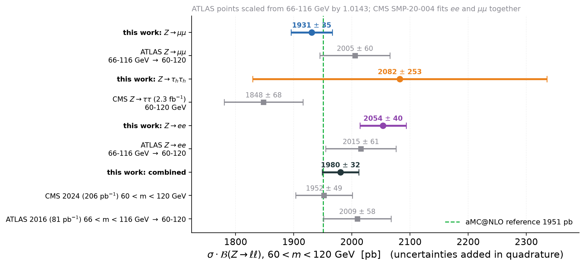

# 05 — Orthogonality, and how we compare with CMS and ATLAS

Three questions this page answers: are the three channels really disjoint, do we use the same
systematics as the published measurements, and how does each channel compare with the published
measurement of the same decay.

---

## 1. Are the three channels orthogonal?

**Yes, to better than 0.002 % in every pair.** The relevant test is the *selection*, not the
primary dataset: in CMS an event that fires two triggers appears in two primary datasets, so
`SingleMuon`, `Electron` and `Tau` are not disjoint by construction.

| | μμ | ττ | ee |
|---|---|---|---|
| trigger | `HLT_IsoMu24 \|\| IsoTkMu24` | `HLT_DoubleMediumIsoPFTau35*` | `HLT_Ele27_WPTight_Gsf` |
| required | **exactly two** tight muons, p_T > 26/20 | **exactly two** τh, p_T > 40, DeepTau Tight | **exactly two** medium electrons, p_T > 20 |
| e veto | no | **yes** (MVA noIso WP90, p_T > 10, relIso < 0.3) | — |
| μ veto | — | **yes** (medium ID, p_T > 10, relIso < 0.3) | no |
| τh veto | no | — | no |

**ττ ∩ μμ = ∅ and ττ ∩ ee = ∅ by construction.** The ττ selection vetoes any medium muon above
10 GeV and any WP90 electron above 10 GeV. A μμ event has two *tight* muons above 20 GeV, which
pass the veto definition with essentially unit efficiency; an ee event has two medium electrons
above 20 GeV. Neither can survive the ττ veto.

The one caveat worth stating: `z-tautau` has 110 ± 13 prefit `DYee` events in its signal region —
Z → ee where the electrons faked τh. Those events survived the electron veto precisely *because*
they were not reconstructed as electrons, so they cannot simultaneously satisfy z-ee's
"exactly two medium electrons". Even taking all 110 as an overlap gives 0.5 % of the ττ SR and
0.0017 % of the ee SR, and the induced statistical correlation is √(0.005 × 1.7·10⁻⁵) ≈ 3·10⁻⁴.

**μμ ∩ ee is not empty, but it is 61 events.** Neither channel vetoes the other's flavour, so an
event can have exactly two tight muons *and* exactly two medium electrons. That requires a
four-lepton final state, so only ZZ → 4ℓ contributes (WZ → 3ℓν cannot: three leptons cannot give
two same-flavour pairs of the right multiplicity). z-mumu measured it directly on the `ZZ_4L`
skim: of the 1016 ZZ → 4ℓ events in the μμ signal region, **61** also have two opposite-sign
medium electrons with 60 < m_ee < 120 GeV —

* 0.0006 % of the 10 378 567 μμ events,
* 0.001 % of the 6 320 097 ee events.

The induced correlation between the two data-statistical uncertainties is of order
√(6·10⁻⁶ × 1·10⁻⁵) ≈ 8·10⁻⁶. `comb/model.build` therefore sets ρ = 0 for `Data statistics` and
`rho_override` deliberately does not touch it: this is a measured fact, not a modelling choice.

**What would break this.** Adding an eτh or μτh channel. Those are *not* orthogonal to μμ or ee —
they share the same primary datasets and an e/μ leg — and would need an explicit overlap removal
before entering the combination. It is the reason the ττ channel pays for its e/μ veto.

---

## 2. Do we use the same systematics as CMS and ATLAS?

The two benchmark analyses of the same quantity:

| | CMS-SMP-20-004 ([2408.03744](https://arxiv.org/abs/2408.03744)) | ATLAS ([1603.09222](https://arxiv.org/abs/1603.09222)) | CMS Z→ττ ([1801.03535](https://arxiv.org/abs/1801.03535)) |
|---|---|---|---|
| L | 206 pb⁻¹ | 81 pb⁻¹ | 2.3 fb⁻¹ |
| window | 60–120 GeV | 66–116 GeV | 60–120 GeV |
| channels | ee and μμ fitted **together** | ee and μμ **separately** | five ττ final states fitted together |
| total syst. on σ_tot | **0.90 %** | 1.0 % (ee) / 1.1 % (μμ) on C, ⊕ 1.8 % on A | 3.1 % |
| luminosity | 2.3 % | 2.1 % | 1.9 % |

### What they have that we have too

| source | CMS SMP-20-004 | ATLAS | ours |
|---|---:|---:|---|
| lepton reco / ID / isolation efficiency | 0.28 (stat) ⊕ 0.16 (syst) | 0.9 ⊕ 0.3 (ee), 0.9 ⊕ 0.5 (μμ) | `Muon efficiency` 0.87 %, `Electron efficiency` 0.35 %, `Tau ID` 8.4 % |
| lepton trigger efficiency | inside "Efficiency" | 0.1 (ee), 0.2 (μμ) | μμ: inside `Muon efficiency`; ττ: `Tau trigger` 3.0 %; **ee: none** |
| lepton energy / momentum scale | shape NP | 0.2 (ee), 0.1 (μμ) | μμ: `Muon momentum` 0.37 %; ττ: `Tau energy scale` 1.5 %; **ee: none** |
| L1 trigger prefiring | 0.34 | n/a (ATLAS has no prefiring) | `L1 prefiring` 0.18–0.61 % |
| pileup modelling | inside efficiency | < 0.1 | `Pileup` 0.13–0.55 % |
| MC simulation statistics | 0.16 | — | `Gammas` 0.38 % (μμ), 1.16 % (ee), 3.9 % (ττ) |
| electroweak + tt background cross sections | 0.04 | in background | `Background normalisation` 0.08–2.6 % |
| PDF + α_s | 0.43 | 0.1 (in C) ⊕ in A | `Acceptance: PDF` + `α_s`, `Signal modelling` |
| μ_R, μ_F scales | 0.66 | in A | `Acceptance: QCD scale`, `Signal modelling` |
| luminosity | 2.3 | 2.1 | **1.2 %** — ours is the best of the three (final 2016 normtag) |

### What they have that we do **not** — the gaps

Five, and four of them are in z-ee:

1. **Electron trigger efficiency (z-ee).** ATLAS quotes 0.1 %, CMS folds it into "Efficiency".
   z-ee applies **no trigger scale factor and assigns no uncertainty** for
   `HLT_Ele27_WPTight_Gsf`; its weight is `genWeight × prefire × PU × RecoSF × IDSF`. z-mumu
   measures its trigger efficiency by tag-and-probe; z-tautau has per-leg τh trigger SFs.
2. **Electron energy scale and resolution (z-ee).** ATLAS 0.2 %; CMS carries it as a shape NP.
   z-ee applies no electron energy correction and has no corresponding nuisance parameter. It is
   the one systematic that moves the *shape* of the very peak it fits, and its absence is a
   plausible contributor to the −2.9σ `Pileup` and +3.6σ `L1Prefiring` pulls.
3. **Charge misidentification (z-ee).** ATLAS quotes 0.1 % for Z → ee and explicitly none for
   Z → μμ. z-ee requires opposite sign and assigns nothing for electron charge flips, which in
   CMS are a few per mille in the barrel and up to ~1 % in the endcap.
4. **Final-state radiation (z-ee).** CMS carries "Resum. + FSR" at 0.12 %; z-mumu recovers FSR
   photons from the `FsrPhoton` collection and fits `PS_FSR`; z-tautau quotes `A_fsr`. z-ee does
   neither — and the ee channel is where FSR matters *most*, because electrons radiate more.
5. **Multijet / fake background (z-ee).** CMS quotes "QCD multijet" at 0.14 % (syst) ⊕ 0.07 %
   (stat). z-mumu has a same-sign muon fake factor (`Fakes`, 0.04 %); z-tautau's whole analysis is
   a fake factor. z-ee has no data-driven fake estimate and no uncertainty for one.

None of these is large — together they are well under 1 % — so they do not explain the ee–μμ
disagreement, which is 6 %. They are listed because a reviewer will ask.

### What we have that they do not

* **`Fit residual`** (z-ee, 0.88 % of μ) — not a physical systematic at all; see [01](01-inputs.md).
* **`SigModel`** (z-mumu, 0.40 %) — powheg vs aMC@NLO. CMS does the equivalent as
  "Resum. + FSR" (DYTURBO vs MADGRAPH5_aMC@NLO), ATLAS folds it into A. Same intent, different pair.
* **`MET`** (z-tautau, 0.8 %) — the di-τ mass uses the MET covariance; no analogue in a Z → ℓℓ
  counting measurement.
* An explicitly **un-renormalised** theory normalisation on the signal (z-ee). Neither published
  analysis does this, and neither could: it is forbidden by construction when μ is the POI.

### The one that should embarrass us

CMS constrains the **τh ID efficiency to 2.2 %** by fitting five ττ final states simultaneously
and promoting the τh ID nuisance parameter to a POI. z-tautau quotes **8.4 %** for the same thing,
taken from the TauPOG scale factors. That single difference is most of why CMS reaches 3.1 %
systematic on σ(Z → ττ) and z-tautau reaches 12 %. It is the strongest argument in this repository
for adding eτh/μτh regions — and it is exactly what `docs/03-method.md` says a MultiFit would buy.

---

## 3. Per channel, against the published measurement of the same decay

Everything is put on **60 < m < 120 GeV**. The ATLAS numbers are quoted in 66–116 GeV and scaled
by σ(60–120)/σ(66–116) = **1.0143**, computed at LHE level from the same aMC@NLO sample
(`z-mumu/output/v2/gensums.json`, `h_lhe_mll`); the model dependence of a 1.4 % correction is
negligible here.

| decay | this work | published | difference |
|---|---|---|---|
| Z → μ⁺μ⁻ | 1931 ± 35 pb | ATLAS 2005 ± 60 pb (1977 ± 60 at 66–116) | **−1.1σ** |
| Z → e⁺e⁻ | 2054 ± 40 pb | ATLAS 2015 ± 61 pb (1987 ± 61 at 66–116) | **+0.5σ** |
| Z → τhτh | 2082 ± 253 pb | CMS 1848 ± 68 pb (all five ττ final states) | **+0.9σ** |
| combined ℓℓ | 1980 ± 32 pb | CMS 1952 ± 49 pb; ATLAS 2009 ± 58 pb | +0.5σ; −0.4σ |

**Read the first two rows together.** Each of our two precise channels agrees with the ATLAS
measurement of the same decay at the 1σ level — and yet they disagree with *each other* by 3.0σ.
There is no contradiction: ATLAS's per-channel uncertainty is ±60 pb, ours are ±35 and ±40 pb, so
a 123 pb gap sits comfortably inside the published error bars while being far outside ours. This
is the clearest statement of why agreement with a published number is not a validation at this
precision, and why the ee/μμ ratio ([03](03-method.md)) is the sharper test.

Three more remarks.

* **CMS SMP-20-004 publishes no per-channel cross section.** It fits the ee and μμ final states
  with one signal strength, so the only CMS point available is the combined one. ATLAS is the only
  13 TeV measurement that publishes Z → ee and Z → μμ separately (its Table 2), which is why it
  carries the per-channel comparison despite the narrower window.
* **ATLAS's own two channels agree**: 1987 ± 61 (ee) against 1977 ± 60 (μμ), and its
  R_Z = σ_ee/σ_μμ is consistent with unity. Its combination has χ²/N = 3.0/3 against our 9.67/2.
* **The ττ comparison is the loosest**, because CMS measures the *inclusive* Z → ττ cross section
  from five final states while z-tautau uses τhτh alone, with a ~40 % contribution from outside
  the 60–120 GeV window at generator level in that final state (CMS says so explicitly). Both are
  quoted in the same window after correction, so the comparison is fair, but ±253 pb against
  ±68 pb means it tests very little.
