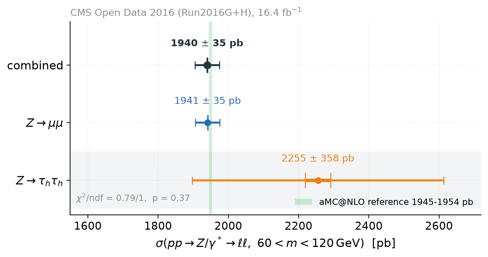
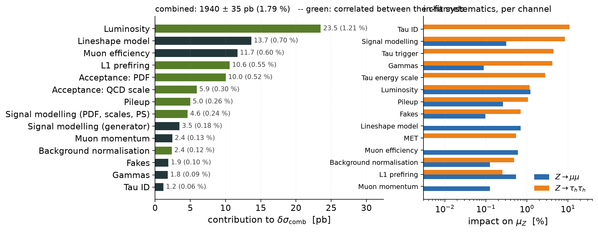
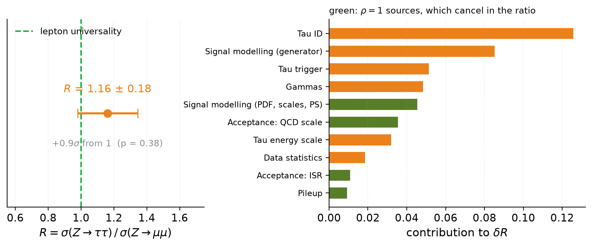
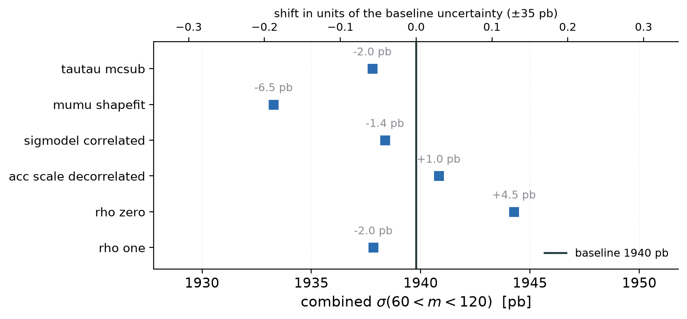
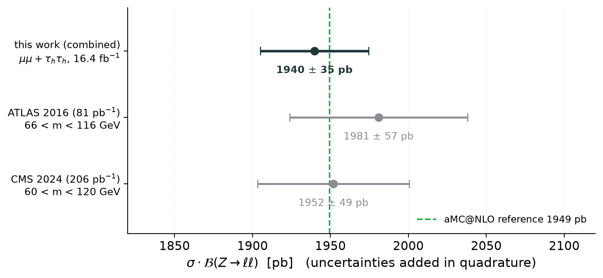

# Combined Z cross section from Z -> mu mu and Z -> tau_h tau_h

*Generated by `run_combination.py` on 2026-09-15 from
`output/combination_result.json`. Do not edit by hand -- edit the code or the docs.*

CMS Open Data 2016, Run2016G+H, L = 16393.381 pb^-1 (normtag), sqrt(s) = 13 TeV.

## Result

> **sigma(pp -> Z/gamma* -> ll, 60 < m_ll < 120 GeV) = 1940 +- 35 pb**
> = 1940 +- 0.6 (stat) +- 23 (syst)
> +- 12 (acc) +- 24 (lumi) pb   (1.79 %)
>
> per lepton flavour, assuming lepton universality. Channel compatibility:
> chi2/ndf = 0.79/1, p = 0.37.

The profile-likelihood form of the same combination, which carries the tau tau channel's asymmetric uncertainty exactly, gives 1939 +35 / -35 pb -- the same answer.



## Inputs

| channel | variant | mu_Z | reference [pb] | sigma(60-120) [pb] | rel. | GoF p |
|---|---|---|---:|---:|---:|---:|
| **Z -> mu mu** | counting | 0.9935 +0.0167 -0.0167 | 1953.9 | **1941 +- 35** | 1.8 % | n/a |
| **Z -> tau_h tau_h** | nominal | 1.1596 +0.1920 -0.1632 | 1944.9 | **2255 +- 358** | 15.9 % | 0.18 |

Both are TRExFitter v1.8.0 profile-likelihood fits performed by the channel groups; this
combination reads their published results (`z-mumu/fit/results/zmumu_fit_result.json`,
`z-tautau/output/results.json`) and does not refit. The `reference` column is the aMC@NLO prediction each
channel's `mu_Z` multiplies -- the two channels normalise to slightly different aMC@NLO references for the same quantity (1953.9 pb for mu mu, 1944.9 pb for tau tau, a 0.47 % difference discussed in [docs/01-inputs.md](docs/01-inputs.md)), which is why the combination is done on the cross sections and not on `mu_Z`. The `mu_Z` uncertainty shown is the in-fit one; the acceptance uncertainty (0.61 % for mu mu, 3.7 % for tau tau) sits outside both fits and is added in the `sigma` column.

The z-mumu input is the **counting extraction** recommended by that channel's review
(`z-mumu/REVIEW.md`, finding F3: the 30-bin shape fit moves `mu_Z` by up to 1.5 % with the binning
and the shape systematics, so the review asks for the counting value plus a +-0.7 % lineshape
term until the `SigModel` template is fixed). Using the 30-bin fit instead shifts the combination
by -6.5 pb, listed under the variations below.

## Where the uncertainty comes from

| source | pb | of sigma | correlated? |
|---|---:|---:|:---:|
| Luminosity | 23.51 | 1.21 % | yes |
| Lineshape model | 13.65 | 0.70 % | no |
| Muon efficiency | 11.68 | 0.60 % | no |
| L1 prefiring | 10.58 | 0.55 % | yes |
| Acceptance: PDF | 10.02 | 0.52 % | yes |
| Acceptance: QCD scale | 5.91 | 0.30 % | yes |
| Pileup | 4.99 | 0.26 % | yes |
| Signal modelling (PDF, scales, PS) | 4.62 | 0.24 % | yes |
| Signal modelling (generator) | 3.46 | 0.18 % | no |
| Muon momentum | 2.43 | 0.13 % | no |
| Background normalisation | 2.38 | 0.12 % | yes |
| Fakes | 1.88 | 0.10 % | no |
| Gammas | 1.79 | 0.09 % | no |
| Tau ID | 1.18 | 0.06 % | no |
| Acceptance: MC stat. | 0.87 | 0.05 % | no |
| Data statistics | 0.63 | 0.03 % | no |
| Tau trigger | 0.48 | 0.02 % | no |
| Acceptance: $\alpha_s$ | 0.47 | 0.02 % | yes |
| Tau energy scale | 0.30 | 0.02 % | no |
| Acceptance: ISR | 0.09 | 0.00 % | yes |
| MET | 0.06 | 0.00 % | no |



The combination is **luminosity-dominated and completely dominated by the mu mu channel**:

* weights: mu mu +1.0048, tau tau -0.0048;
* mu mu alone gives 1941 +- 35 pb, so adding the tau tau channel improves the uncertainty by 0.13 % -- it changes nothing;
* the tau tau weight is **negative**. That is standard BLUE behaviour, not an error: when the correlation exceeds the ratio of the two uncertainties (0.15 > 0.10 here), the less precise measurement is used to pull on the shared systematic rather than to average the value down. Its effect is 1.5 pb.

The reason there is nothing to gain: the luminosity uncertainty is 24 pb, fully correlated between the channels and therefore irreducible by combining. Both channels use the same 16393.381 pb^-1 with the same 1.2 %. A third channel of comparable precision would not help either; a better luminosity calibration would.

## Lepton universality

This is the part the combination cannot test, because it *assumes* universality. Measured
separately, with everything correlated cancelling:

> **R = sigma(Z -> tau tau) / sigma(Z -> mu mu) = 1.16 +- 0.18**
> (+0.9 sigma from 1, p = 0.38)



## Cross-checks and variations

| variation | sigma [pb] | shift | in sigma | what it changes |
|---|---:|---:|---:|---|
| tautau mcsub | 1937.8 | -2.0 | -0.06 | z-tautau fake factor with genuine-tau subtraction (its open issue 1) |
| mumu shapefit | 1933.3 | -6.5 | -0.19 | z-mumu 30-bin shape fit instead of the reviewed counting extraction |
| sigmodel correlated | 1938.4 | -1.4 | -0.04 | generator comparison treated as correlated between channels |
| acc scale decorrelated | 1940.8 | +1.0 | +0.03 | acceptance QCD-scale term uncorrelated between channels |
| rho zero | 1944.3 | +4.5 | +0.13 | all systematics uncorrelated (naive) |
| rho one | 1937.8 | -2.0 | -0.06 | all systematics fully correlated |

Every variation moves the result by less than 0.19 of the total uncertainty, and the two rows that bracket the correlation model (`rho zero`, `rho one`) span only 6.4 pb. The correlation model is therefore not the limiting assumption -- the luminosity calibration is.



## Comparison with published measurements

| measurement | value | reference |
|---|---|---|
| CMS, 13 TeV, 206 pb^-1, 60 < m < 120 GeV | 1952 +- 4 (stat) +- 18 (syst) +- 45 (lumi) pb | [CMS-SMP-20-004, arXiv:2408.03744](https://arxiv.org/abs/2408.03744) |
| ATLAS, 13 TeV, 81 pb^-1, 66 < m < 116 GeV | 1981 +- 7 (stat) +- 38 (syst) +- 42 (lumi) pb | [arXiv:1603.09222](https://arxiv.org/abs/1603.09222) |

This work: **1940 +- 35 pb** (60 < m < 120 GeV). It agrees with the CMS measurement of the same quantity within 0.2 sigma, and with the aMC@NLO reference the channels normalise to (1945-1954 pb) within 0.3 sigma. The ATLAS number is quoted in a narrower mass window (66-116 GeV) and is not directly comparable.



## Correlation model in full

| source | rho | mu mu [pb] | tau tau [pb] |
|---|:---:|---:|---:|
| Tau ID | 0 | 0.00 | 244.03 |
| Signal modelling (generator) | 0 | 3.35 | 165.52 |
| Tau trigger | 0 | 0.00 | 99.82 |
| Signal modelling (PDF, scales, PS) | 1 | 5.05 | 94.15 |
| Gammas | 0 | 1.73 | 93.94 |
| Acceptance: QCD scale | 1 | 6.20 | 76.16 |
| Tau energy scale | 0 | 0.00 | 62.19 |
| Data statistics | 0 | 0.61 | 35.88 |
| Luminosity | 1 | 23.52 | 26.09 |
| Pileup | 1 | 5.08 | 24.03 |
| Acceptance: ISR | 1 | 0.00 | 21.02 |
| Acceptance: MC stat. | 0 | 0.87 | 16.06 |
| Fakes | 0 | 1.87 | 15.88 |
| Lineshape model | 0 | 13.59 | 0.00 |
| Acceptance: $\alpha_s$ | 1 | 0.52 | 13.22 |
| MET | 0 | 0.00 | 12.30 |
| Muon efficiency | 0 | 11.63 | 0.00 |
| Acceptance: PDF | 1 | 10.03 | 11.00 |
| Background normalisation | 1 | 2.42 | 10.95 |
| L1 prefiring | 1 | 10.56 | 5.72 |
| Acceptance: FSR | 1 | 0.00 | 5.56 |
| Muon momentum | 0 | 2.42 | 0.00 |

Justification for every row: [docs/02-correlation-model.md](docs/02-correlation-model.md).

## What this is not

This is a **covariance combination of two TRExFitter fits, not a TRExFitter MultiFit.** The
channel workspaces are not committed to the repository and were not rebuilt, so the shared
nuisance parameters are correlated through their `Category` labels instead of being profiled
jointly. The MultiFit configuration is generated and syntax-checked
([fit/comb.config](fit/comb.config), [fit/run_multifit.py](fit/run_multifit.py)) and the exact
recipe to run it is in that file; [docs/03-method.md](docs/03-method.md) explains what the joint
fit would add. At this precision the difference is expected to be small -- the mu mu channel
dominates and its own fit is already profiled -- but it is not zero, and the claim is not made.

Known caveats inherited from the inputs, none of them corrected here:

* `z-mumu/REVIEW.md` F8: `MuonReco` is documented as 0.4 % per muon but applied as 0.4 % per
  event. If the per-muon reading is right, the mu mu muon-efficiency term grows by 0.35 % in
  quadrature (+3 pb on the combined uncertainty, no shift in the value).
* `z-mumu/REVIEW.md` F6: the pileup profile is ~4 % low; the channel quotes 0.16 % for it.
* `z-tautau` open issue 1: the nominal fake factor double-counts genuine taus; the `mcsub`
  variant is listed above and shifts the combination by
  -2.0 pb.

## Reproduce

```bash
source ../setup.sh
python run_combination.py          # checks, result, figures, JSON, this file
python run_combination.py --check  # input validation and closure tests only
```
