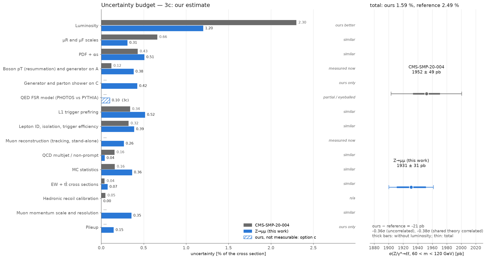
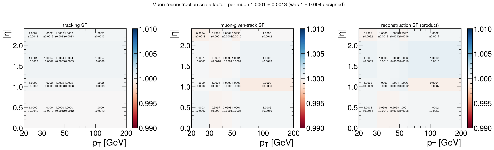
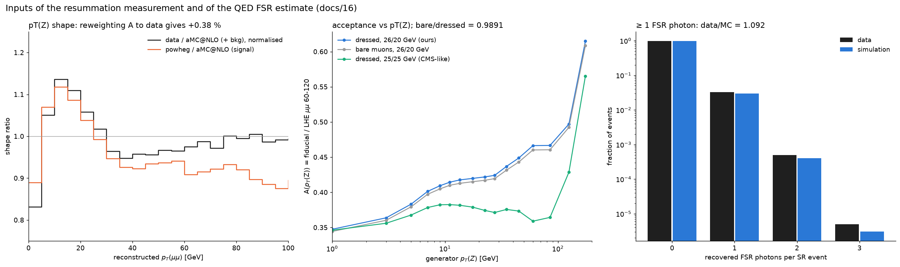
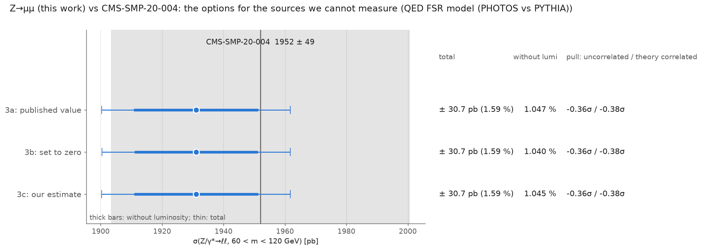

# 16 — Our uncertainties against CMS-SMP-20-004, and a fair comparison

The CMS measurement of the same quantity, **CMS-SMP-20-004** ([arXiv:2408.03744](https://arxiv.org/abs/2408.03744),
JHEP 04 (2025) 162), was linked from `combination/docs/05-vs-published.md` §2 (removed; `git show 17d497c:combination/docs/05-vs-published.md`). This page takes its
uncertainty table apart row by row, says for each row whether this analysis does the same, better, less
or nothing, closes the gaps that can be closed by a measurement, estimates the one that cannot (three
options, carried to the end), and compares the two cross sections. The procedure is written up for the
other channels in `docs/UNCERTAINTY_PARITY.md` (agent: `.claude/agents/uncertainty-parity-auditor.md`).

Scripts: `scripts/v2_7_reco_tnp.py` (reconstruction efficiency), `scripts/v2_8_theory_acceptance.py`
(generator-level acceptance studies), `zmumu/acceptance.py` (the acceptance block), `scripts/v2_5_fit.py`
(the fit with the measured SF), `scripts/v2_9_cms_parity.py` (budget, options, comparison, plots) and the shared
`fitting/uncertainty_parity.py`. Numbers: `output/v2/cms_parity/`.

> **Status (17 Sep 2026): promoted and frozen.** This pass was first run as a tagged fit (`zmumu_recosf`) next
> to an unchanged baseline. On 17 Sep its measurements became the channel result: the reconstruction SF is
> applied in `fit/zmumu.config` / `fit/fitinputs/zmumu.root`, and the acceptance uncertainties (60–120 GeV
> denominator, boson pT, generator, PS FSR, QED FSR option c) are in the `acceptance` block of
> `fit/results/zmumu_fit_result.json` and `zmumu.root.meta.json`, which the combination reads. The fit is
> identical to the tagged one (μ_Z = 0.9883 ± 0.0141). "Baseline" below means the 15 Sep result,
> `fit/results/zmumu_v2_15sep_fit_result.json`. The analysis is frozen (tag `zmumu-freeze-2026-09-17`).

## 1. What CMS measured, and where its uncertainties are

| | CMS-SMP-20-004 (13 TeV part) | this analysis |
|---|---|---|
| data | 206 pb⁻¹, 2017 **low-pileup** runs (⟨μ⟩ ≈ 3) | 16.4 fb⁻¹, 2016 G+H (⟨μ⟩ ≈ 25) |
| channels | e⁺e⁻ and μ⁺μ⁻ **fitted together** (lepton universality) | μ⁺μ⁻ |
| fiducial volume | **Born** leptons, pT > 25 GeV, \|η\| < 2.4, 60 < m < 120 | **dressed** muons (ΔR < 0.1), pT > 26/20 GeV, \|η\| < 2.4, 60 < m < 120 |
| extraction | binned likelihood fit of m(ℓℓ) (COMBINE), NPs | binned likelihood fit of m(μμ) (TRExFitter), NPs |
| σ_fid | 754 ± 2 (stat) ± 3 (syst) ± 17 (lumi) pb (Table 10) | 790.2 ± 0.2 ± 6.1 ± 9.6 pb (other volume) |
| **σ_tot(60–120)** | **1952 ± 4 (stat) ± 18 (syst) ± 45 (lumi) pb** (Table 13) | 1931 ± 30 pb (frozen result; 1931 ± 33 pb on 15 Sep) |

The fiducial numbers are not comparable (different volumes and lepton definitions); the total cross
section in 60 < m < 120 GeV is, and it is the quantity used below.

**There is no μμ-only breakdown anywhere.** Checked: the paper (Tables 3–8 give the systematic
uncertainties for the combined ℓℓ fit only; "electron and muon channels are also fitted separately and
the results are compatible" — no numbers), its HEPData record
([ins2816048](https://www.hepdata.net/record/153468): distributions and cross sections, no uncertainty
tables per flavour) and the CMS public-results page (no additional material). Every CMS number on this
page is therefore for e and μ together, and rows dominated by electrons (2017 prefiring is an ECAL
effect; the electron efficiency is 70 % against 90 % for muons) are larger than a muon-only analysis
would carry.

CMS Table 7, Z → ℓ⁺ℓ⁻ column (total inclusive, 13 TeV; luminosity 2.3 % not in the table), with the
fiducial Table 4 alongside:

| source | total σ [%] | fiducial σ [%] | what it is (section 7 of the paper) |
|---|---:|---:|---|
| μR and μF scales | 0.66 | 0.07 | acceptance: largest shift of the 6 non-extreme variations |
| PDF + αs | 0.43 | 0.03 | acceptance: NNPDF3.1 prescription |
| Trigger prefire correction | 0.34 | 0.26 | stat ⊕ ±20 % of the prefiring probability |
| Efficiency (stat) | 0.28 | 0.26 | T&P reco, ID, iso, trigger; charge × pT × η bins, uncorrelated |
| Efficiency (syst) | 0.16 | 0.15 | T&P signal/background model, PHOTOS-vs-PYTHIA FSR in the templates, tag selection |
| MC sim. stat | 0.16 | 0.12 | Barlow–Beeston |
| QCD multijet (syst) | 0.14 | 0.14 | prompt contamination of iso/anti-iso regions ±10/20 % (a W background; enters Z through the joint fit) |
| Resum. + FSR | 0.12 | — | acceptance: DYTURBO NNLO+NNLL vs aMC@NLO, and PYTHIA vs PHOTOS |
| QCD multijet (stat) | 0.07 | 0.02 | misidentification-factor statistics |
| Hadronic recoil calibration | 0.05 | 0.02 | W p_T^miss; enters Z through the joint fit |
| EW + tt̄ cross section | 0.04 | 0.01 | 5 % on top and diboson |
| **Total** | **0.90** | **0.40** | |
| *in the text only* | | | lepton momentum scale and resolution (shape NPs, "small"); signal outside the fiducial volume tied to the signal by theory ratios |

## 2. Summary

* **Every CMS row is now accounted for.** Two gaps were closed by measurements: the muon
  reconstruction efficiency (assigned before, now tag-and-probe on the unskimmed NanoAOD) and the
  boson-pT/resummation uncertainty of the acceptance (absent before, now constrained by our own
  pT(μμ) spectrum). One source cannot be measured here, the QED FSR model (PHOTOS vs PYTHIA); it
  is estimated with three options. Hadronic recoil does not apply to a Z → μμ selection.
* **The comparison:** σ(Z/γ* → μμ, 60–120 GeV) = **1931 ± 0.6 (stat) ± 20.2 (syst) ± 23.2 (lumi) pb**
  (± 30.7 pb) against CMS **1952 ± 4 ± 18 ± 45 pb** (± 48.6 pb): **−21 pb, −0.36σ** (−0.38σ with the
  scale and PDF rows treated as common to both). The choice among the three FSR options changes our
  total by 0.004 %: the comparison is limited by the two luminosities, not by any row we estimate.
* Without luminosity our uncertainty is 1.05 %, CMS's 0.94 %. Where ours is larger:
  generator lineshape on C (SigModel, 0.38 %, a row CMS does not carry), prefiring (0.52 %, 2016 muon
  prefiring), MC statistics (0.36 %), muon momentum (0.35 %) and the pT(Z) row (0.38 %).
* Two errors in the channel's own bookkeeping surfaced on the way (§3.3): the acceptance theory
  uncertainties were evaluated for m > 50 GeV instead of 60–120 GeV (0.61 % → 0.58 %), and "the
  reconstruction efficiency is not measurable in NanoAOD" was not true.



## 3. Row by row: what we do like CMS, better, less, or not at all

Numbers in % of σ(60–120). Ours are the post-fit impacts of the fit with the measured reconstruction SF
(`fit/results/zmumu_fit_result.json` since 17 Sep; `zmumu_recosf` when this was written) and the acceptance rows outside the fit; full table with
both descriptions in `output/v2/cms_parity/parity_zmumu.md`.

| source | CMS | ours | status |
|---|---:|---:|---|
| luminosity | 2.30 | 1.20 | better |
| μR, μF scales (A ⊕ C) | 0.66 | 0.31 | similar |
| PDF + αs (A ⊕ C) | 0.43 | 0.51 | similar |
| resummation / boson pT and generator on A | 0.12 | 0.38 | **measured now** |
| QED FSR model (PHOTOS vs PYTHIA) | in the row above | a 0.12 / b 0 / c 0.10 | **estimated** (§5) |
| L1 prefiring | 0.34 | 0.52 | similar |
| lepton ID, isolation, trigger efficiency | 0.32 | 0.39 | similar |
| muon reconstruction (tracking, stand-alone) | in "Efficiency" | 0.26 | **measured now** (was 0.78, assigned) |
| QCD multijet / non-prompt | 0.16 | 0.04 | similar |
| MC statistics | 0.16 | 0.36 | similar |
| EW + tt̄ cross sections | 0.04 | 0.07 | similar |
| hadronic recoil | 0.05 | — | not applicable |
| muon momentum scale and resolution | text only | 0.35 | similar |
| generator and parton shower on C | — | 0.42 | ours only |
| pileup | — | 0.15 | ours only |

### 3.1 Done like CMS

* **μR/μF scales** — the same 7-point prescription on the acceptance (CMS: "6 non-extreme variations,
  largest shift", identical set), plus the fit's `QCDScale` on C. Ours is half of theirs because of the
  volume, not the method: the same aMC@NLO weights in a CMS-like **25/25 GeV** dressed volume give
  0.38 % instead of 0.27 % (`scripts/v2_8_theory_acceptance.py`); symmetric cuts are more sensitive
  to the radiation pattern (the PS ISR variation of A triples, 0.07 → 0.21 %). The rest of the gap to
  0.66 % we cannot reproduce from the paper; their scale row is probably evaluated with their
  Born-level volume and fit set-up.
* **PDF + αs** — NNPDF3.1 Hessian eigenvectors and αs ± 0.0015 on A (and on C in the fit), as CMS.
* **L1 prefiring** — NanoAOD `L1PreFiringWeight_Up/Dn` = statistics ⊕ 20 % of the prefiring
  probability, exactly CMS's recipe. Ours is larger because 2016 has muon-system prefiring (mean weight
  0.980 for Z → μμ) while 2017 prefiring is an ECAL effect.
* **ID, isolation, trigger efficiency** — tag-and-probe fits with background-shape, fit-range, tag and
  generator-template variants and an MC-truth closure (docs/12); CMS varies the same things. The FSR
  modelling of the T&P templates, which CMS evaluates with PHOTOS, is covered by our 70–110 GeV
  fit-range variant, which removes the radiative tail from the fit.
* **Non-prompt / multijet** — fake factor with statistical and 30 % method uncertainty (CMS: iso/anti-iso
  misidentification factor, prompt contamination ± 10/20 %).
* **MC statistics** — Barlow–Beeston lite, as CMS.
* **Background cross sections** — 6–10 % (CMS 5 %).
* **Momentum scale and resolution** — shape nuisance parameters from our Z-peak calibration; CMS uses
  Rochester corrections and calls the effect small.

### 3.2 Done better than CMS

* **Luminosity** — 1.2 % (2016 legacy calibration, normtag) against 2.3 % for the 2017 low-pileup runs.
* **Boson pT on the acceptance** — constrained by our data rather than by comparing two predictions (§4.2).
* **Reconstruction efficiency statistics** — 211 M events and 15–20 M probes per efficiency.

### 3.3 Eyeballed, assigned or not done to the full extent (before this pass)

| item | before | now |
|---|---|---|
| muon reconstruction efficiency | SF = 1 ± 0.4 %/muon **assigned** ("not measurable in NanoAOD", docs/11) — 0.78 % on σ, the largest non-luminosity experimental row | **measured**: SF = 1.0001 ± 0.0013 per muon, 0.26 % on σ (§4.1) |
| resummation / boson-pT modelling of A | **absent** (SigModel and PS weights acted on C only) | **measured**: data-driven pT(Z) reweighting ⊕ powheg vs aMC@NLO ⊕ PS FSR on A, 0.38 % (§4.2) |
| QED FSR model | **absent** | **estimated**, three options (§5) |
| acceptance theory denominator | PDF/αs/scale evaluated for A(m > 50) (0.52/0.03/0.32 %) and applied to σ(60–120) | recomputed for A(60–120): 0.50/0.03/0.29 % |
| T&P statistical uncertainty | shifted coherently over all (pT, η) cells (CMS: uncorrelated per cell) | unchanged: conservative, and 0.1 % or below |
| charge dependence of the SFs | SFs not binned in charge (CMS bins in charge) | unchanged: each Z event has one μ⁺ and one μ⁻, so SF(μ⁺)·SF(μ⁻) differs from SF² only at second order in the charge asymmetry |
| momentum calibration | Z-peak calibration instead of Rochester corrections (not obtainable here) | unchanged: measured, with its own NPs |

### 3.4 Missing, not applicable, ours only

* **Missing after this pass:** nothing, apart from the estimated QED FSR model.
* **Not applicable:** hadronic recoil calibration (a W p_T^miss calibration that enters CMS's Z number
  through the joint W+Z fit; no p_T^miss is used here).
* **Ours only:** pileup (CMS's runs have ⟨μ⟩ ≈ 3); the generator lineshape and parton-shower
  variations on C (`SigModel`, `PS_ISR`, `PS_FSR`), which the 12-bin shape fit needs (docs/14).

## 4. What was measured

### 4.1 Muon reconstruction efficiency — `scripts/v2_7_reco_tnp.py`, `zmumu/recoeff.py`

Our ID tag-and-probe starts from a *loose* muon (global or tracker), so the missing factor is the
probability that a real muon becomes one. It factorises into two efficiencies, each with an unbiased
probe in NanoAODv9. The skims cannot be used, because a failing probe is by definition not a loose
muon, so the step reads all 152 unskimmed SingleMuon files (211 M events after trigger and GRL) and
10 DY aMC@NLO files (~15 min, 8 workers).

| efficiency | probe | pass | binning | SF per muon (Z-muon weighted) |
|---|---|---|---|---|
| tracking | stand-alone muon (`Muon_isStandalone`), pT > 20 | the probe, or a non-stand-alone global/tracker muon within ΔR < 0.3, has an inner track | \|η\| (the stand-alone pT migrates failing probes to high pT) | **1.0002 ± 0.0011** |
| muon given track | isolated track (`IsoTrack` ∪ tracks of global/tracker muons): pT > 20, PF iso < 0.05, \|dxy\| < 0.05, \|dz\| < 0.2, PuppiMET < 40 | global or tracker muon | pT × \|η\| | **0.9999 ± 0.0006** |
| **reconstruction (product)** | | | | **1.0001 ± 0.0013** (per event 1.0002 ± 0.0027) |

Tag: tight, isolated, trigger-matched muon with pT > 26 GeV. Pass and fail mass spectra are fitted
simultaneously in every cell, in data and in simulation. The signal shapes are generator-matched
templates, smeared and shifted. **The background shapes are the same-sign spectra of the same cell.**
The systematic is the largest deviation among the variants (CMSShape background, 70–110 GeV range,
tag pT > 30 GeV with iso < 0.10) ⊕ the closure of the fit on simulation against the generator-matched
count. Three lessons from getting there, all visible in `output/v2/tnp/reco_result.json` and the
`reco_*` plots:

1. **An exponential background is wrong here.** A tag plus a random isolated track is sculpted by the
   kinematic cuts into a broad peak under the Z. With the exponential, data came out 0.6 % low per
   muon (0.9938). With the same-sign shapes the fits agree with the same-sign-subtracted counts.
2. **The loose isolated-track probe (charged iso < 0.1) leaves too much W+jets/tt̄ under the failing
   probes.** Its variant spread was 0.26 % per muon. The tight probe removes 80 % of that background at
   25 % of the probes, and its variants agree to 0.08 %. The loose probe's muon-given-track SF,
   0.9996 ± 0.0026, is kept as a cross-check.
3. **The failing-signal width must be bounded** for track probes (≤ 3 GeV extra smearing; stand-alone
   probes need up to 15 GeV). Otherwise the fit widens the failing "signal" into the background. At
   ε → 1 HESSE errors are meaningless: MINOS is used.

In the fit (`v2_5_fit.py`; a tagged fit `zmumu_recosf` until the promotion on 17 Sep) the SF multiplies
the MC templates and `MuonReco` becomes ± 0.27 % per event (was 0.8 %):
**μ_Z = 0.9883 ± 0.0141** (15 Sep: 0.9881 ± 0.0157), σ_fid = 790.2 ± 0.2 ± **6.1** (syst) ± 9.6 (lumi) pb
(15 Sep: syst 8.5 pb), GoF p = 0.79.



### 4.2 Boson pT, resummation and generator on the acceptance — `scripts/v2_8_theory_acceptance.py`, `v2_9_cms_parity.py`

CMS takes the difference between DYTURBO (NNLO+NNLL resummation) and aMC@NLO in the acceptance.
We have no NNLL event sample, but we have something CMS's comparison does not use: our own
pT(μμ) spectrum with 10.4 M events.

* A generator-level pass over 19.8 M aMC@NLO events (12 parent files from EOS) gives **A in bins of the
  boson pT**. Our acceptance rises from 0.35 at pT(Z) ≈ 1 GeV to 0.42 at 20 GeV. That makes it
  sensitive to the pT(Z) shape: a ±5 % tilt over 0–30 GeV moves A by 0.26 % (0.05 % in a 25/25 GeV
  volume).
* The reconstructed pT(μμ) in the signal region, data over the aMC@NLO prediction (normalised), is
  **0.83** (0–5 GeV), **1.14** (10–15 GeV), 0.95 (35–40 GeV). The spectrum is visibly mismodelled, in the
  same direction as powheg's (0.89, 1.12, 0.93).
* **Reweighting the generator pT(Z) spectrum by that ratio changes A by +0.38 %.** That is the row,
  larger than the PS ISR variation (0.07 %) and than the powheg shape (0.07 %). It is taken as an
  uncertainty, not a correction, as CMS does with its DYTURBO difference; applying it as a correction
  would move σ(60–120) by −0.4 %.
* Added in quadrature: powheg vs aMC@NLO on A, 0.045 % (dressed; the LHE-lepton "Born" volume
  differs by 1.4 % between the generators because LHE leptons precede the shower recoil, which is why
  our fiducial volume is dressed); PS FSR (QCD) on A, 0.03 %.



## 5. What cannot be measured: the QED FSR model (PHOTOS vs PYTHIA)

**1. Why we cannot measure it.** Every 2016 UL Drell–Yan sample in the Open Data showers QED radiation
with PYTHIA 8: aMC@NLO FxFx, madgraph MLM, powheg (checked against `datasets/datasets.tsv` and the
dCache listing). A PHOTOS sample needs generation, GEANT4 simulation and reconstruction in CMSSW,
which this cluster cannot run. A generator-level PHOTOS run would change only A, while the sensitivity
sits in C: the reconstructed pT cuts act on bare muons, the fiducial volume on dressed ones. The data
do see QED radiation, through the rate of recovered FSR photons. That rate mixes the FSR model with the
photon reconstruction efficiency, so it can size the effect but not measure it.

**2. Why the CMS number cannot be cited.** CMS quotes PYTHIA vs PHOTOS only merged with resummation
("Resum. + FSR", 0.12 %). It is for electrons and muons fitted together, and for a Born-level fiducial
volume with symmetric 25 GeV cuts. There is no FSR-only and no muon-only number. A Born-level volume
is much more FSR-sensitive than our dressed one (electrons radiate more than muons, too), so the number
neither separates nor transfers. The generator-group PHOTOS/PYTHIA comparisons behind it are internal.

**3. The three options**, carried through the whole comparison (`output/v2/plots/cms_parity_option_{a,b,c}.png`,
overview `cms_parity_options.png`):

| option | value | reasoning |
|---|---:|---|
| **a** take CMS's | 0.12 % | the whole "Resum. + FSR" row assigned to FSR alone: an upper bound, double-counting the resummation part we measured |
| **b** set to zero | 0 | both showers are NLL-accurate for collinear QED radiation, and the ΔR < 0.1 dressing absorbs most of it |
| **c** our estimate | **0.10 %** | (size of the effect) × (plausible model difference) = \|A_bare/A_dressed − 1\| = **1.09 %** (generator level; it bounds what reconstructed bare-muon pT cuts can see of FSR) × \|data/MC − 1\| of the fraction of SR events with a recovered FSR photon = 3.29 % / 3.01 % → **9.2 %** (all attributed to the FSR model, none to photon efficiency) = 0.100 % |

| option | our total | stat ⊕ syst | ours − CMS | pull (uncorrelated / theory correlated) |
|---|---:|---:|---:|---:|
| a | ± 30.7 pb (1.59 %) | 1.047 % | −21.0 pb | −0.36σ / −0.38σ |
| b | ± 30.7 pb (1.59 %) | 1.040 % | −21.0 pb | −0.36σ / −0.38σ |
| **c** | **± 30.7 pb (1.59 %)** | **1.045 %** | **−21.0 pb** | **−0.36σ / −0.38σ** |

The choice does not matter at this precision; c is the one we would quote.



## 6. The comparison, and how to read it

| | σ(60–120) [pb] | stat | syst | lumi | total |
|---|---:|---:|---:|---:|---:|
| CMS-SMP-20-004 (e and μ, 2017 low-pileup) | 1952 | 4 | 18 | 45 | 48.6 |
| this work, 15 Sep (before this pass) | 1931 | 0.6 | 20.7 ⊕ 11.8 (A) | 23.4 | 32.9 |
| **this work, frozen result (option c)** | **1931** | **0.6** | **20.2** | **23.2** | **30.7** |

(`handoff.md` quotes the frozen result as 1931 ± 0.6 ± 15.0 (syst) ± 13.5 (acc) ± 23.4 (lumi) = ± 30 pb:
the same budget, with the luminosity taken on the prediction and the total from the fit's MINOS error with
the profiled luminosity. The parity module takes 1.2 % of the measured value and adds in quadrature.)

* **−21 ± 57 pb, −0.36σ.** The two measurements agree. The difference is 1.1 %, well inside CMS's
  2.3 % luminosity uncertainty alone.
* **Correlations.** The luminosities are independent calibrations of different years. The scale and PDF
  rows are computed with the same generator family and PDF set, so they are partly common;
  `rho_reference = 1` for those two rows gives −0.38σ, the upper edge of that effect. Everything
  experimental is independent.
* **What would sharpen it.** A fiducial comparison would remove the acceptance rows (0.69 % for us; CMS's
  fiducial syst is 0.40 %). It needs our σ_fid converted into CMS's Born-level 25/25 GeV volume, and a
  clean Born-level lepton definition: the last pre-FSR copies are not all kept in the pruned NanoAOD
  `GenPart`, and LHE leptons are generator-dependent (§4.2). The luminosity would still dominate.
* **Our Z → μμ against CMS's ℓℓ.** CMS assumes lepton universality in its combined fit; the
  comparison therefore tests our μμ number against an e+μ average, which is fair only because CMS
  reports that its separate e and μ fits are compatible.

## 7. Reproduce

```bash
source ../fitting/setup.sh
python scripts/v2_7_reco_tnp.py                     # reconstruction efficiency, ~15 min (dCache parents), then fits ~5 min
python scripts/v2_8_theory_acceptance.py --files 12 # generator-level acceptance studies, ~4 min (EOS)
python scripts/v2_5_fit.py                          # the fit with the reconstruction SF and the acceptance block, ~10 min
python scripts/v2_9_cms_parity.py                   # parity file, options, comparison, plots, <1 min
```

(or `python run_v2.py --from 7`). The promotion on 17 Sep changed `fit/zmumu.config` and `fit/fitinputs/zmumu.root`
(μ_Z 0.9881 → 0.9883, `MuonReco` 0.8 → 0.27 %) and the acceptance block of `zmumu.root.meta.json`
(0.61 % → 0.70 %). The combination MultiFit reads both; its μμ acceptance parameters are now `Acc_PDF`,
`Acc_AlphaS`, `Acc_QCDScale`, `Acc_PS_FSR` (shared with ττ), `Acc_PTZ_mumu`, `Acc_Generator_mumu`,
`Acc_QEDFSR_mumu` and `AccStat_mumu` (`combination/combLieke/config/channels.json`).
