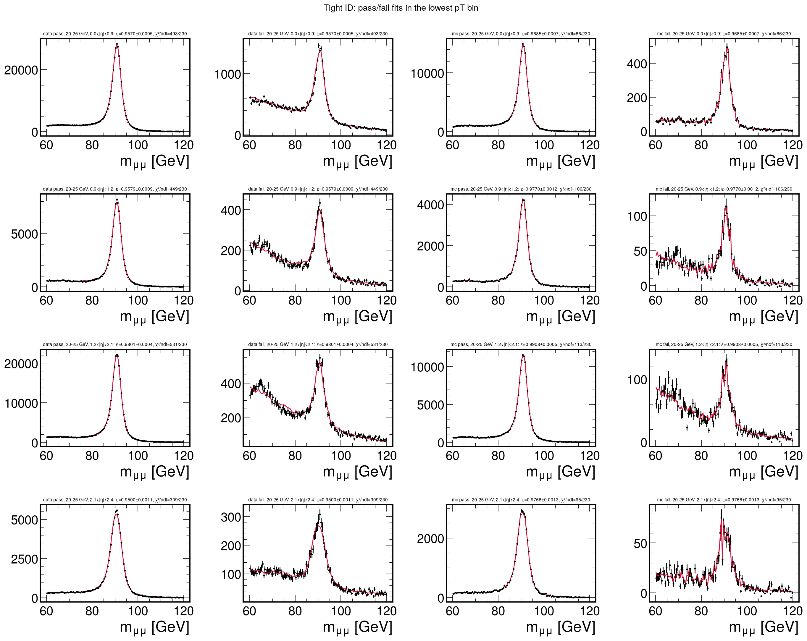
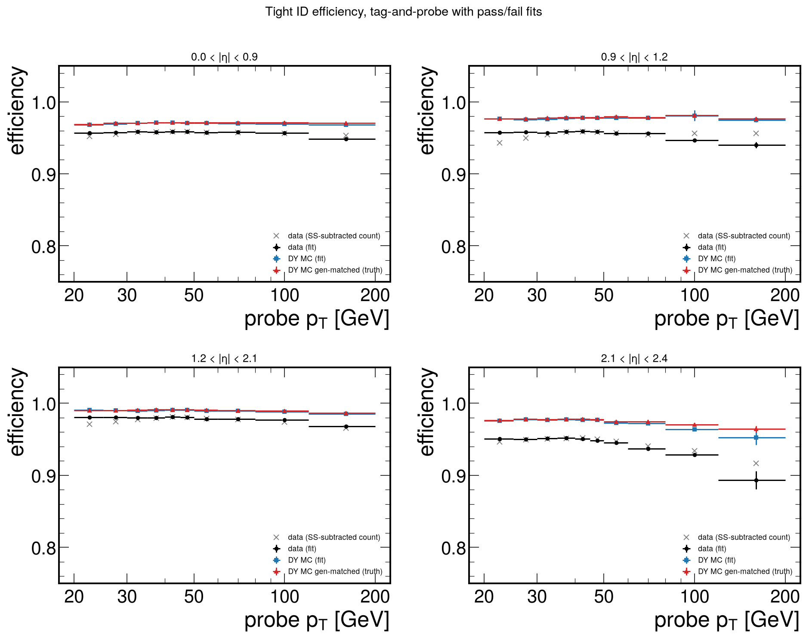
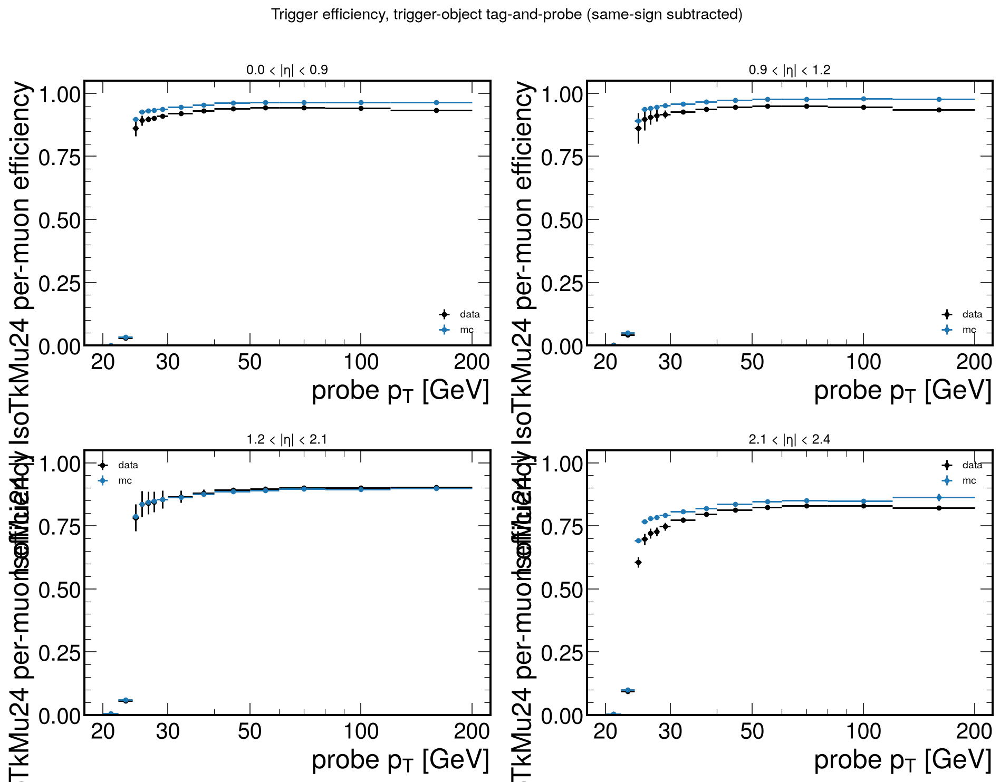

# How tag-and-probe works

This page explains the Z → μμ tag-and-probe from the first idea to the numbers that go into the fit.
The technical references are [docs/12](12-tag-and-probe-fits.md) (ID, isolation, trigger) and
[docs/16 §4.1](16-uncertainties-vs-cms.md) (reconstruction). The code is in `zmumu/tnp.py`, `zmumu/recoeff.py`,
`scripts/v2_2_tnp.py` and `scripts/v2_7_reco_tnp.py`. Every number below comes from
`output/v2/tnp/tnp_result.json` (15 Sep 2026), `reco_result.json` (16 Sep 2026) and the per-cell fits in
`tnp_fits.pkl`. These are the inputs of the frozen result (17 Sep 2026, git tag `zmumu-freeze-2026-09-17`).

## 1. The problem

The fit compares data with the simulated DY → μμ prediction. The simulation reconstructs, identifies,
isolates and triggers on muons with its own efficiencies, and those are not exactly the detector's. If
the simulation keeps 97 % of real muons and the detector keeps 96 %, the prediction is 1 % too high per
muon and 2 % per event, so μ_Z comes out 2 % low.

The correction is a **scale factor** per muon,

```
SF(pT, |η|) = ε_data / ε_sim
```

and every simulated event is weighted by the product over its muons. ε_sim is easy to get, because the
simulation knows which muons are real. ε_data is the hard part: data carries no label that says which
reconstructed objects are real muons.

## 2. The idea

The Z peak supplies that label. Take a dimuon event in which one muon is unambiguously good: the
**tag**. Pair it with a second object, the **probe**, selected with *none* of the requirements you want
to measure. If the pair mass sits at the Z mass, the probe is almost always the other muon of a
Z decay. It is a real muon, and it was chosen without looking at whether it passes. Then ask the probe
the question:

```
ε = N_pass / (N_pass + N_fail)
```

Do exactly the same in simulation, and the ratio is the scale factor.

Two real pairs from run 278969 (the pairs shown in talk clips 4-24 and 4-25), both with the tag in the barrel:

| event | tag | probe | m(tag, probe) | tight ID |
|---|---|---|---:|---|
| 351671459 | pT 54.7 GeV, η 0.01, tight, iso 0.065, 4 muon stations, trigger-matched | pT 33.0 GeV, η 0.72, global + tracker, 3 stations | 90.45 GeV | **pass** |
| 351264945 | pT 46.7 GeV, η 0.52, tight, iso 0.012, 3 stations, trigger-matched | pT 42.7 GeV, η 0.81, tracker-only, 1 station | 89.90 GeV | **fail** |

Three conditions make the method work:

* The tag is tight enough that the event is a real Z → μμ, and it is **matched to the trigger**, so the
  event was recorded because of the tag and not because of the probe.
* The probe is loose. It carries only what the efficiency needs as a denominator.
* The mass window gives purity. The purity is not perfect, and most of what remains lands among the
  failing probes (§5).

## 3. A chain of conditional efficiencies

A selected muon has passed several requirements in turn. Each one is measured *given* the one before it:
the probe of each step is the pass of the previous step. The product is then the full per-muon
efficiency, with nothing counted twice.

| step | probe (denominator) | pass (numerator) | input, method | result |
|---|---|---|---|---|
| 1 tracking | stand-alone muon (muon-system track), pT > 20 GeV | has an inner track: is global or tracker, or a global/tracker muon without its own stand-alone track lies within ΔR < 0.3 | unskimmed NanoAOD, fit | SF 1.0002 ± 0.0011 |
| 2 muon given track | isolated track (`IsoTrack` ∪ tracks of global/tracker muons), PF iso < 0.05, \|dxy\| < 0.05, \|dz\| < 0.2 cm, PuppiMET < 40 GeV | is a global or tracker muon | unskimmed NanoAOD, fit | SF 0.9999 ± 0.0006 |
| 3 ID | loose muon: global or tracker, pT > 20 GeV, \|η\| < 2.4 | `tightId`, \|dxy\| < 0.2 cm, \|dz\| < 0.5 cm | skims, fit | SF map, mean 0.980 |
| 4 isolation | passed step 3 | `pfRelIso04_all` < 0.15 | skims, fit | SF map, mean 1.006 |
| 5 trigger | passed step 4 | matched to an IsoMu24 / IsoTkMu24 trigger object | skims, same-sign-subtracted count | per muon (pT > 26 GeV): 0.907 data, 0.923 simulation |

Steps 1 and 2 together are the **reconstruction** efficiency, the probability that a real muon becomes the
loose muon that step 3 starts from: SF_reco = 1.0001 ± 0.0013 per muon. A sixth efficiency,
*anti-isolation* (0.20 < iso < 1.0 given step 3), is measured the same way. It calibrates the prompt
subtraction of the fake factor (docs/13) and is not applied to the signal.

## 4. Tag, probe and pairs (steps 3–5)

**Events.** The 2016 G+H SingleMuon v2 skims (`$BND_SKIM_DIR`) and DY aMC@NLO, weighted with
sign(genWeight) × pileup weight. Only events that fired `HLT_IsoMu24 || HLT_IsoTkMu24`, pass the MET
filters and have at least one good vertex are used.

**Tag.** A tight muon (`tightId`, \|dxy\| < 0.2, \|dz\| < 0.5 cm, `pfRelIso04_all` < 0.15, \|η\| < 2.4) with
pT > 26 GeV, **matched to a trigger object**. Without the match, some events were recorded only because
the probe fired the trigger. A muon that fires the trigger is nearly always a good muon, so those probes
pass too often. v1 did not match the tag, and that raised its efficiencies by 0.1 % (ID) and 0.2 % (iso)
per muon (docs/08 §4).

**Pairs.** Every pair of muons in the event is used **in both orientations**: A as tag with B as probe,
and B as tag with A as probe. When both muons qualify as tags, each probes the other. That gives two
measurements, not a double count. The pair must be opposite-sign with 60 < m < 120 GeV. Same-sign pairs
are filled separately: they contain no Z, so they show the background.

**Cells.** Probe pT [20, 25, 30, 35, 40, 45, 50, 60, 80, 120, 200] GeV × \|η\| [0, 0.9, 1.2, 2.1, 2.4]
(barrel, overlap, endcap, forward endcap) gives 40 cells. Probes above 200 GeV go into the last bin.
Each cell holds a pass and a fail histogram of m(tag, probe) in 0.5 GeV bins.

**Totals.** 20.05 M opposite-sign pairs in data and 14.7 M (weighted) in simulation. For tight ID,
19.12 M probes pass and 0.93 M fail.

## 5. Why counting is not enough

Not every pair in the 60–120 GeV window is a Z decay. A tag can pair with a non-prompt muon from a
b or c hadron decay, a pion decaying in flight, or a punch-through, from W+jets, tt̄ or bb̄ events.
Such objects *fail* far more often than real muons do. The same-sign pairs, which contain no Z, show
this: 38 k pass tight ID and 193 k fail, against 19.1 M and 0.93 M for opposite-sign pairs.

Only 5 % of the probes fail, so even a small background is a large share of the failing sample. The
background share of the failing tight-ID probes, from the fits:

| probe pT [GeV] | 20–25 | 25–30 | 30–35 | 35–40 | 40–45 | 45–50 | 50–60 | 60–80 | 80–120 | 120–200 |
|---|---:|---:|---:|---:|---:|---:|---:|---:|---:|---:|
| \|η\| 0.0–0.9 | 61 % | 36 % | 20 % | 11 % | 7 % | 9 % | 16 % | 34 % | 54 % | 63 % |
| \|η\| 0.9–1.2 | 66 % | 44 % | 23 % | 13 % | 8 % | 9 % | 15 % | 38 % | 49 % | 67 % |
| \|η\| 1.2–2.1 | 75 % | 55 % | 33 % | 19 % | 12 % | 12 % | 19 % | 44 % | 63 % | 70 % |
| \|η\| 2.1–2.4 | 58 % | 33 % | 19 % | 12 % | 6 % | 7 % | 12 % | 26 % | 41 % | 54 % |

At low pT the non-prompt muons are soft. At high pT the Z supplies few probes, so the same background
weighs more. The effect on the barrel tight-ID efficiency (counts in 70–110 GeV):

| probe pT [GeV] | 20–25 | 25–30 | 30–35 | 35–40 | 40–45 | 45–50 | 50–60 | 60–80 | 80–120 | 120–200 |
|---|---:|---:|---:|---:|---:|---:|---:|---:|---:|---:|
| raw opposite-sign count | 0.917 | 0.942 | 0.952 | 0.955 | 0.956 | 0.956 | 0.952 | 0.944 | 0.927 | 0.898 |
| same-sign subtracted count | 0.952 | 0.955 | 0.958 | 0.958 | 0.958 | 0.958 | 0.957 | 0.957 | 0.956 | 0.953 |
| pass/fail fit | 0.957 | 0.957 | 0.959 | 0.958 | 0.959 | 0.958 | 0.957 | 0.958 | 0.957 | 0.949 |

Tight ID should not depend on pT, so the drop of the raw count at both ends is background.
Subtracting the same-sign pairs removes most of it, but not all: heavy-flavour pairs (bb̄ → μμ) are
mostly opposite-sign. At 20–25 GeV the opposite-sign continuum under the failing-isolation peak is
about ten times the same-sign one (docs/08 §4). A fit separates the two by **shape**: the Z makes a
peak and the background does not.

## 6. The fit

In each cell the pass and fail spectra are fitted **together**, with an extended binned Poisson
likelihood over 60–120 GeV (120 bins):

```
pass(m) = N ε       S_pass(m) + B_pass exp(−λ_pass (m − 60))
fail(m) = N (1 − ε) S_fail(m) + B_fail exp(−λ_fail (m − 60))
```

* **N** (the Z probes in the cell) and **ε** are the only parameters that pass and fail share. ε is a
  fit parameter, so its uncertainty comes straight from HESSE.
* **S_pass and S_fail** are the Z line shapes from simulation, taken from pairs in which both muons are
  generator-matched prompt muons (`genPartFlav == 1`), in the same cell, with **pass and fail
  separately**. Failing probes are often tracker-only muons with a worse momentum resolution, so their
  peak is wider. Each template is shifted by δm and convolved with a Gaussian of width σ, four free
  parameters in all, to absorb data/simulation differences in momentum scale and resolution.
* The **backgrounds** are two independent exponentials, each with a free normalisation and slope.
* That makes ten parameters. The minimiser is `iminuit` MIGRAD with strategy 1, and SIMPLEX followed by
  MIGRAD again when the first minimum is not valid; HESSE comes last. With fewer than 50 failing probes,
  δm and σ of the fail shape are frozen.

**The same fit on simulation.** The simulation is fitted with exactly the same model. Its histograms are
weighted, so the likelihood uses n/k with k = Σw²/Σw per spectrum (the Bohm–Zech scaling). A bias of the
method then enters ε_data and ε_sim alike and cancels in the ratio. The simulation also has the truth,
the count of generator-matched probes, so the **closure** |ε_fit − ε_truth| measures the part that does
not cancel. On average the fit on simulation lies 0.13 % (ID) and 0.30 % (iso) below the truth.

### One cell: 40–45 GeV, |η| < 0.9, tight ID

| | data | simulation |
|---|---:|---:|
| probes in 60–120 GeV, pass / fail | 2 005 323 / 93 464 | (weighted) |
| fitted Z probes N | 2 085 659 | |
| background share of passing / failing probes | 0.3 % / 7.4 % | – / 0.9 % |
| extra Gaussian smearing σ, pass / fail | 0.20 / 0.44 GeV | |
| **ε** | **0.95851 ± 0.00015** | **0.97113 ± 0.00021** |

SF = 0.95851 / 0.97113 = **0.9870 ± 0.0004** (stat 0.0003 ⊕ syst 0.0003). The fits of the lowest pT bin,
where the background is largest, are in `output/v2/plots/tnp_fits_id_lowpt.png`:



## 7. Uncertainties

**Statistical:** from the fits, data ⊕ simulation. The mean over the cells is 0.0015 (ID) and 0.0009 (iso).

**Systematic:** every choice in §6 is varied, **the same way in data and in simulation**, and the SF is
recomputed. Per cell, the largest deviation is added in quadrature to the closure.

| variant | tests | mean \|ΔSF\|, ID | mean \|ΔSF\|, iso |
|---|---|---:|---:|
| CMSShape background (erfc × exp) | background shape | 0.0017 | 0.0007 |
| fit range 70–110 GeV | background shape, FSR tail | 0.0020 | 0.0007 |
| tag pT > 30 GeV and iso < 0.10 | tag purity and bias | 0.0007 | 0.0008 |
| POWHEG templates instead of aMC@NLO | signal shape model | 0.0012 | 0.0014 |
| closure: fit on simulation vs generator truth | residual method bias | 0.0014 | 0.0030 |
| **systematic per cell, mean** | | **0.0031** | **0.0041** |

In the likelihood these become the nuisance parameters `MuonID` and `MuonIso`. All 40 cells move together
by ±1σ (stat ⊕ syst) on both muons. Moving the statistical part coherently is conservative; CMS treats
it as uncorrelated between cells.

## 8. Results



**Tight ID.** Data lies below simulation in every cell: by about 1 % in the barrel and endcap, 2 % in
the overlap and 3 % in the forward endcap. Barrel: data 0.949–0.959 against simulation 0.968–0.971. The
largest gap is in the forward endcap at high pT: SF 0.938 ± 0.052 at 120–200 GeV.

| pT [GeV] \ \|η\| | 0.0–0.9 | 0.9–1.2 | 1.2–2.1 | 2.1–2.4 |
|---|---:|---:|---:|---:|
| 20–25 | 0.9883 ± 0.0014 | 0.9805 ± 0.0023 | 0.9895 ± 0.0011 | 0.9741 ± 0.0024 |
| 25–30 | 0.9874 ± 0.0012 | 0.9822 ± 0.0021 | 0.9903 ± 0.0007 | 0.9718 ± 0.0024 |
| 30–35 | 0.9879 ± 0.0006 | 0.9803 ± 0.0019 | 0.9904 ± 0.0014 | 0.9737 ± 0.0012 |
| 35–40 | 0.9870 ± 0.0005 | 0.9812 ± 0.0014 | 0.9899 ± 0.0011 | 0.9738 ± 0.0012 |
| 40–45 | 0.9870 ± 0.0004 | 0.9805 ± 0.0010 | 0.9902 ± 0.0007 | 0.9732 ± 0.0013 |
| 45–50 | 0.9874 ± 0.0006 | 0.9801 ± 0.0011 | 0.9898 ± 0.0007 | 0.9710 ± 0.0008 |
| 50–60 | 0.9863 ± 0.0010 | 0.9779 ± 0.0020 | 0.9881 ± 0.0013 | 0.9715 ± 0.0020 |
| 60–80 | 0.9872 ± 0.0015 | 0.9775 ± 0.0016 | 0.9880 ± 0.0009 | 0.9639 ± 0.0052 |
| 80–120 | 0.9870 ± 0.0031 | 0.9652 ± 0.0113 | 0.9890 ± 0.0035 | 0.9636 ± 0.0121 |
| 120–200 | 0.9797 ± 0.0042 | 0.9645 ± 0.0086 | 0.9826 ± 0.0037 | 0.9381 ± 0.0517 |

**Isolation.** Above 35 GeV the SF is within 0.5 % of 1 in the barrel. At low pT the isolation efficiency
drops to 0.79–0.86 in data and slightly lower in simulation, and the SF rises to 1.005–1.041 at 20–25 GeV.
In that bin the fit on simulation lies 1.5–2.5 % below the truth, and the closure makes the uncertainty
about ±0.02.

| pT [GeV] \ \|η\| | 0.0–0.9 | 0.9–1.2 | 1.2–2.1 | 2.1–2.4 |
|---|---:|---:|---:|---:|
| 20–25 | 1.0054 ± 0.0236 | 1.0185 ± 0.0258 | 1.0208 ± 0.0205 | 1.0407 ± 0.0180 |
| 25–30 | 1.0027 ± 0.0030 | 1.0077 ± 0.0059 | 1.0118 ± 0.0045 | 1.0214 ± 0.0046 |
| 30–35 | 1.0008 ± 0.0007 | 1.0086 ± 0.0013 | 1.0077 ± 0.0011 | 1.0153 ± 0.0027 |
| 35–40 | 1.0011 ± 0.0007 | 1.0052 ± 0.0005 | 1.0060 ± 0.0006 | 1.0106 ± 0.0007 |
| 40–45 | 0.9999 ± 0.0004 | 1.0029 ± 0.0004 | 1.0031 ± 0.0002 | 1.0063 ± 0.0007 |
| 45–50 | 1.0004 ± 0.0004 | 1.0018 ± 0.0003 | 1.0027 ± 0.0004 | 1.0061 ± 0.0008 |
| 50–60 | 0.9998 ± 0.0004 | 1.0016 ± 0.0007 | 1.0005 ± 0.0003 | 1.0042 ± 0.0010 |
| 60–80 | 0.9994 ± 0.0008 | 1.0022 ± 0.0016 | 0.9996 ± 0.0008 | 1.0022 ± 0.0045 |
| 80–120 | 0.9986 ± 0.0014 | 0.9979 ± 0.0045 | 0.9998 ± 0.0024 | 1.0046 ± 0.0069 |
| 120–200 | 1.0030 ± 0.0029 | 1.0041 ± 0.0088 | 1.0038 ± 0.0027 | 1.0084 ± 0.0139 |

**Isolation vs pileup.** Probes with pT > 26 GeV in four `PV_npvsGood` bins (< 15, 15–22, 22–30, ≥ 30)
give SF 1.0013, 1.0024, 1.0042 and 1.0075. The half-spread, 0.0031, is reported as a cross-check and is not a
nuisance parameter.

## 9. Trigger (step 5)

The trigger measurement differs from ID and isolation in three ways.

1. **The pass condition is a match.** A muon passes when an HLT muon object lies within ΔR < 0.1 of it.
   The object must have `TrigObj_id == 13`, `filterBits & (2|8)` (the isolation filters of IsoMu24 and
   IsoTkMu24) and pT > 24 GeV. A match counts only in events that fired the OR: in events that did not
   fire, such an object still exists 5 % of the time, from L1_SingleMu20-seeded paths that share the
   filter (docs/08 §3).
2. **The probe is tight and isolated** (steps 3 and 4 passed), and the pair window is 70–110 GeV. The
   tag must still be matched, so the event would have been recorded without the probe.
3. **It is a count, not a fit.** With tight probes the background is small, and the same-sign pairs are
   subtracted. The pT bins are finer across the turn-on: 20, 22, 24, 25, 26, 27, 28, 30, 35, 40, 50, 60,
   80, 120, 200 GeV.



The per-muon efficiency turns on at 24 GeV. On the plateau (pT > 26 GeV):

| | \|η\| 0–0.9 | 0.9–1.2 | 1.2–2.1 | 2.1–2.4 | all |
|---|---:|---:|---:|---:|---:|
| data | 0.932 | 0.940 | 0.884 | 0.798 | 0.907 |
| simulation | 0.956 | 0.969 | 0.880 | 0.825 | 0.923 |

**Systematics.** A variant drops the objects whose L1 seed has 20 ≤ pT < 22 GeV; its difference is added
to the data uncertainty. The closure in simulation is 0.15 % (docs/08 §3).

**Why not reference triggers.** v1 divided by events that fired HLT_Mu50, IsoMu27, Mu27 or Mu45_eta2p1.
Those paths share the L1 seed and the L3 reconstruction with IsoMu24, so the ratio is close to 1 by
construction. In simulation that method is 1.05 % above the truth, and the trigger-object method is 0.15 % above it.
The event efficiency moved from 0.9977 to 0.9835.

**Per event.** An event is triggered if either muon fires:

```
SF_trig = [1 − (1 − ε_data(μ1)) (1 − ε_data(μ2))] / [1 − (1 − ε_sim(μ1)) (1 − ε_sim(μ2))]
```

A second muon below the threshold contributes its turn-on efficiency, not zero. As a check, the map
predicts that both muons are matched in 77.06 % of triggered signal events; 77.07 % are observed (docs/08 §3).
The nuisance parameter `MuonTrigger` shifts the data efficiencies by ±1σ.

## 10. Reconstruction (steps 1 and 2)

The ID probe is already a reconstructed (global or tracker) muon, so steps 3–5 cannot see muons that were
never reconstructed. Until 16 Sep 2026 that factor was assigned as 1 ± 0.4 % per muon, because NanoAOD
has no general tracks. It turns out to be measurable, because NanoAODv9 keeps two probe collections that do not depend on the loose-muon reconstruction:

* **stand-alone muons** (`Muon_isStandalone` without global/tracker): a muon-system track shows that a
  muon was there and carries no inner-tracker information. This is the probe for *tracking*.
* **isolated tracks** (`IsoTrack`, cleaned of loose muons): an inner track that knows nothing about the
  muon system. This is the probe for *muon given track*.

The product of the two efficiencies is the probability that a real muon becomes a loose muon. Details that matter:

* **The skims cannot be used**, because a failing probe is by definition not a loose muon and the skim
  requires two loose muons. The step reads the 152 unskimmed SingleMuon files (211 M events after trigger
  and GRL) and 10 DY files, in about 15 min on 8 workers. Data has 20.0 M stand-alone probes and 15.5 M tight
  isolated-track probes.
* The tag is the same as above, with ΔR(tag, probe) > 0.3.
* **Tracking is binned in |η| only.** The stand-alone pT is poorly measured, so failing (stand-alone-only)
  probes migrate to high pT.
* **The background shape comes from the same-sign pairs** of the same cell, smoothed, with only the
  normalisation free. The kinematic cuts sculpt a tag plus a random isolated track into a broad bump under the Z. An exponential cannot describe that bump, and it made data 0.6 % low per muon.
* **The tight isolated-track probe is the nominal one.** The loose probe (charged iso < 0.10) leaves
  W+jets and tt̄ under the failing probes: its variant spread was 0.26 %, against 0.08 % for the tight
  probe. Its SF, 0.9996 ± 0.0026, is kept as a cross-check.
* **The failing signal's extra width is bounded**: at most 3 GeV for track probes and 15 GeV for
  stand-alone probes. Otherwise the fit widens the failing "signal" until it absorbs the background.
* **MINOS instead of HESSE.** With ε this close to 1, HESSE errors are meaningless. MINOS is used, with a
  binomial floor.

**Results per muon**, weighted over the Z muons: tracking 1.0002 ± 0.0011, muon given track
0.9999 ± 0.0006, **reconstruction 1.0001 ± 0.0013** (per event 1.0002 ± 0.0027).


**Status.** Since the freeze of 17 Sep 2026 the reconstruction SF is part of the result. It multiplies every
simulated template, and `MuonReco` is its measured ±0.27 % per event (±0.8 % when it was assigned). Against
the 15 Sep fit, μ_Z moves from 0.9881 to 0.9883 and the σ_fid systematic drops from 8.5 to 6.1 pb. The 15 Sep
fit is kept as `fit/results/zmumu_v2_15sep_fit_result.json`.

## 11. From scale factors to the prediction

Each simulated event with two selected muons gets the weight

```
w = SF_ID(μ1) SF_ID(μ2) · SF_iso(μ1) SF_iso(μ2) · SF_trig(event)
```

looked up in each muon's (pT, |η|) cell by `tnp.ScaleFactors.event_weights`. The e-μ control region uses
the one-muon version, `single_muon_weights`, with SF_trig = ε_data / ε_sim.

This is the largest single data/simulation correction in the signal region. Data/prediction goes from
0.944 (uncorrected) to 0.950 (pileup), 0.969 (L1 prefiring) and **0.994** (tag-and-probe scale factors):
the SFs lower the prediction by 2.5 %.

## 12. Pitfalls this analysis hit

| pitfall | cost | fix |
|---|---|---|
| tag not trigger-matched (v1) | probes pass too often: +0.1 % (ID), +0.2 % (iso) per muon | tag matched to the trigger object |
| pass/fail counted with background among the failing probes (v1) | efficiencies biased low; σ −1.9 % once corrected | simultaneous pass/fail fits |
| trigger efficiency from reference paths (v1) | +1.05 % against truth in simulation; event efficiency 0.9977 instead of 0.9835 | trigger-object tag-and-probe |
| reconstruction efficiency called "not measurable" | assigned 0.4 %/muon, the largest experimental row after the luminosity | stand-alone and isolated-track probes |
| exponential background under track probes | data 0.6 % low per muon | same-sign background shapes |
| loose isolated-track probe | 0.26 % variant spread | tight probe: 0.08 % |
| unbounded width of the failing signal | the fit absorbs background into the signal | bound on σ_fail |
| HESSE at ε → 1 | meaningless errors | MINOS with a binomial floor |

## 13. Known limitations

* **Fit χ² in data.** The median χ²/ndf over the 40 cells is 2.2 (ID) and 2.1 (iso), and at most 4. The
  example cell has 864/230 with 2 M probes: at that precision the template-plus-Gaussian shape is not
  perfect. The efficiency is robust against it: between 30 and 80 GeV, where the background is small, the fit agrees with the
  same-sign-subtracted count to within 0.1 %, and the background-shape and range variants move it by 0.2 %. The χ² is
  not a goodness-of-fit test here.
* **Minuit validity flags.** Minuit flags 33/40 (ID) and 28/40 (iso) data fits as valid, but only 18/40 and 5/40
  simulation fits. In most of the flagged simulation fits a parameter sits at its limit: pure DY has no
  background, and a fit of simulation with its own templates needs no extra smearing. Those cells close
  against the truth to 0.17 % (ID) and 0.27 % (iso) on average, against 0.09 % and 0.14 % for the valid
  ones, and the closure is part of the systematic. The χ² printed for weighted simulation fits is not
  meaningful where the model is close to zero.
* **Correlations.** The statistical uncertainty is shifted coherently over all cells. The SFs are not
  binned in charge. Each Z event has one μ⁺ and one μ⁻, so that matters only at second order.
* **Trigger by counting.** The trigger efficiency is not fitted.
* **Isolation at 20–25 GeV** carries a ±2 % SF uncertainty, dominated by the closure.
* **Isolation vs pileup.** The isolation SF rises from 1.001 to 1.008 over the four pileup bins. This trend is reported and not
  propagated.
* **Other channels** do not run their own tag-and-probe. z-ee uses the official electron reco/ID SF maps and has no
  trigger SF yet. z-tautau uses TauPOG SFs, and a μτh trigger tag-and-probe is listed as future work.

## 14. Files and commands

| what | where |
|---|---|
| filling, fit model, SF lookup | `zmumu/tnp.py` |
| muon masks, trigger matching | `zmumu/regions.py` (`muon_masks`, `trigger_match`) |
| reconstruction probes, same-sign templates, bounded fit | `zmumu/recoeff.py` |
| drivers | `scripts/v2_2_tnp.py`, `scripts/v2_7_reco_tnp.py` |
| results | `output/v2/tnp/tnp_result.json`, `reco_result.json`; per-cell fits in `tnp_fits.pkl`, `reco_fits.pkl` (not in git) |
| plots | `output/v2/plots/tnp_*.png`, `reco_*.png` |
| numbers frozen for the talk | `presentation/data/zmumu_tnp.json` (clips 4-24 to 4-28) |

The analysis is frozen, so these commands document how the outputs were made; they are not meant to be rerun.

```bash
source setup.sh && cd z-mumu
python scripts/v2_2_pileup.py                # pileup weights for the simulation, needed first
python scripts/v2_2_tnp.py                   # ID/iso/anti-iso/trigger: fill (~30 min) + 400 fits per efficiency
python scripts/v2_2_tnp.py --summarise-only  # refit and replot from the per-file parts
python scripts/v2_7_reco_tnp.py              # reconstruction, unskimmed NanoAOD (~15 min + ~5 min fits)
```
